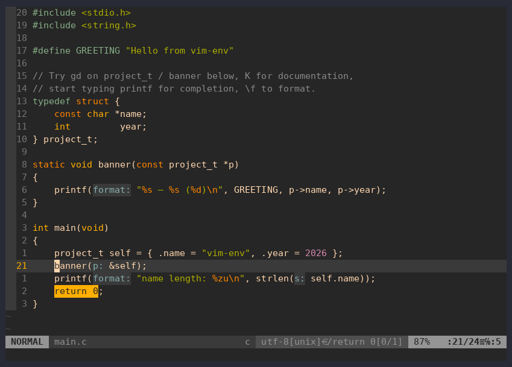
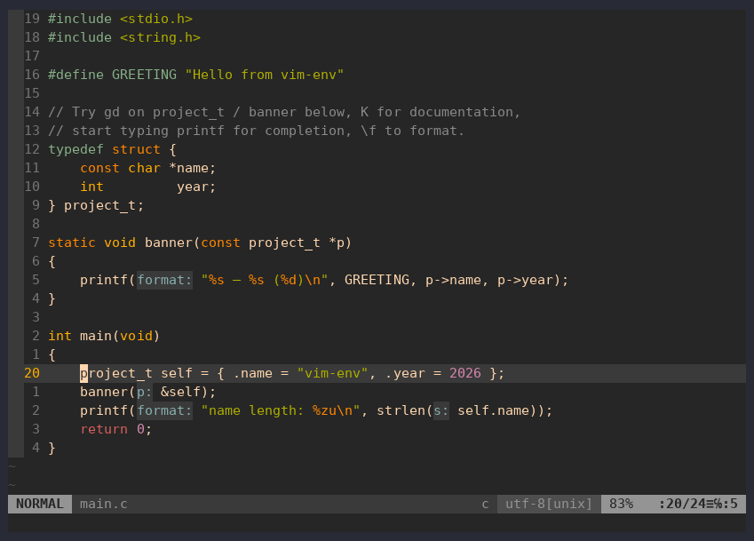
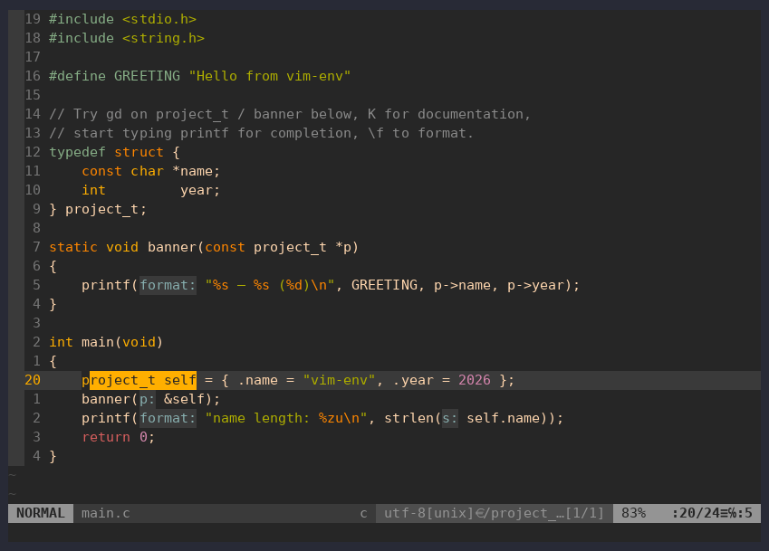
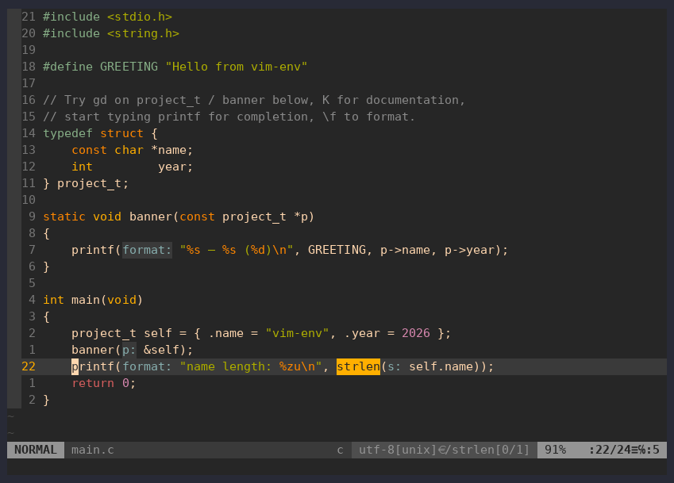
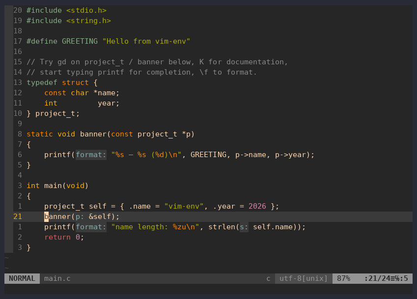
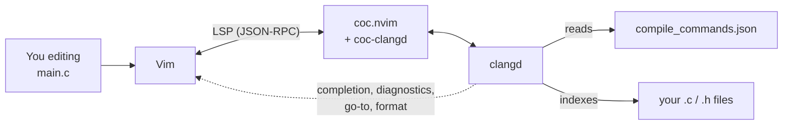
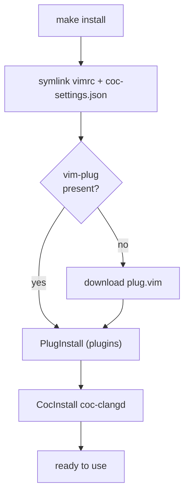
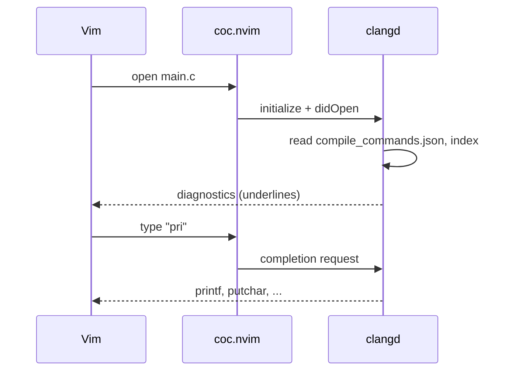
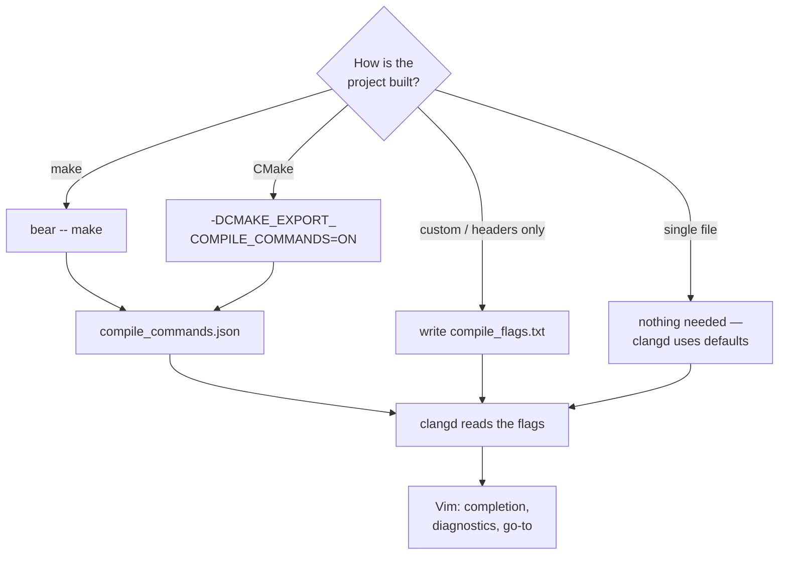

# vim-c-env — Vim as a C/C++ IDE with clangd


[](LICENSE)

A ready-made **Vim setup for C and C++ development**: the **clangd** language
server wired into Vim through **coc.nvim**, with autocompletion,
go-to-definition, find references, hover documentation, live diagnostics,
rename, and **clang-format** formatting. It's a complete `vimrc` plus a
one-command installer for Linux, macOS and Windows, an example project, and a
keybinding cheatsheet.

It gives you a VSCode-like C workflow in plain Vim, running fully locally, with
the gruvbox theme.


*Go-to-definition, hover docs, completion and clang-format in Vim with clangd.*

---

## Contents

- [Features](#features)
- [In action](#in-action)
- [Architecture](#architecture)
- [Requirements](#requirements)
- [Installation](#installation)
- [Makefile targets](#makefile-targets)
- [How it works](#how-it-works)
- [C workflow](#c-workflow)
- [Example project](#example-project)
- [Embedded (ARM Cortex-M)](#embedded-arm-cortex-m)
- [Keybindings](#keybindings)
- [Customizing](#customizing)
- [Full config](#full-config)
- [Troubleshooting](#troubleshooting)
- [Repository layout](#repository-layout)
- [Uninstall](#uninstall)
- [License](#license)

---

## Features

- **C/C++ LSP** via clangd: completion, `gd`/`gr`, hover, diagnostics, rename,
  code actions, formatting (clang-format).
- **clang-tidy** enabled (static-analysis linter).
- **Background index** of the project (fast navigation across the whole codebase).
- **Snippets** for C (`main`, `for`, `guard`, `st`, `mal`, ...) via coc-snippets.
- **Build from Vim:** `\m` runs `make`, compiler errors land in the quickfix list.
- **Debugging** with gdb through Vim's built-in Termdebug: breakpoints, step,
  evaluate, with IDE-style F5/F9/F10/F11 keys.
- **Git:** fugitive (status, blame, diff) and gitgutter (changed-line signs, hunks).
- **Format on save**, off by default, toggled with `:FormatOnSaveToggle`.
- File explorer (NERDTree), fuzzy finder (fzf), status line (airline),
  commenting (nerdcommenter), surround editing (vim-surround).
- **Cheatsheet inside Vim:** `:Cheatsheet` opens a native help page.
- A single `./install.sh` (or `make install`) bootstraps everything from scratch.

---

## In action

All clips are recorded from the [example project](#example-project) with this
exact config.

### Completion

Typing `self.` lists the struct members. clangd checks the half-written line
straight away: a warning and an error show up in the sign column and the
status line.



### Go to definition and references

`gd` jumps from the call to the definition, `Ctrl-o` jumps back, and `gr` finds
every reference to the type.



### Hover documentation

`K` shows the signature under the cursor, including libc functions such as
`strlen` with their documentation.



### Diagnostics

Errors are reported as you type. `]g` jumps to the next one and the message
appears in a float.



### Rename

`\rn` renames a symbol in every place clangd knows about. Comments are left
alone.


### Formatting

`\f` runs clang-format over the file, here after the indentation was scrambled
on purpose.


### Cheatsheet inside Vim

`:Cheatsheet` (or `\?`) opens this keybinding reference as a native Vim help
page next to your code. Links in the contents jump with `CTRL-]`, and
`:help vim-c-env` works too.



---

## Architecture

How the pieces talk to each other while you edit:



Vim is the editor, **coc.nvim** is the LSP client, **clangd** is the brain that
actually understands C. clangd learns your build flags from
`compile_commands.json` and indexes your sources, then feeds results back to Vim.

---

## Requirements

| Tool | Why | Check |
|------|-----|-------|
|  Vim 8.2+ with `+job +timers +channel` | async LSP | `vim --version \| grep +job` |
|  Node.js ≥ 16 | coc.nvim runtime | `node --version` |
|  clangd | C/C++ language server | `clangd --version` |
| bear *(optional)* | generates `compile_commands.json` from `make` | `bear --version` |
| gdb *(optional)* | debugger behind `:Termdebug`; Vim also needs `+terminal` | `gdb --version` |
|  git,  curl | clone + download vim-plug | — |

Check everything at once with **`make doctor`**. Per-OS setup is in
[Installation](#installation).

---

## Installation

These steps assume a freshly installed OS. Install the prerequisites for your
platform, then clone the repo and run the bootstrap.

###  Linux

Prerequisites: Vim built with `+job`, Node.js, clangd, bear, git, curl.

####  Debian /  Ubuntu

```bash
sudo apt update
sudo apt install -y vim-nox nodejs npm clangd bear gdb git curl
```

Install `vim-nox` (or `vim-gtk3`). The minimal `vim-tiny` has no `+job`, and
coc.nvim needs it.

####  Fedora

```bash
sudo dnf install -y vim-enhanced nodejs clang-tools-extra bear gdb git curl
```

clangd ships in `clang-tools-extra`.

####  Arch Linux / Manjaro

```bash
sudo pacman -S --needed vim nodejs clang bear gdb git curl
```

####  openSUSE

```bash
sudo zypper install -y vim nodejs clang-tools bear gdb git curl
```

####  Gentoo

```bash
echo "app-editors/vim terminal" | sudo tee -a /etc/portage/package.use/vim
sudo emerge -q app-editors/vim net-libs/nodejs llvm-core/clang dev-util/bear dev-debug/gdb
```

The `terminal` USE flag gives Vim the `+terminal` feature that the debugger
needs.

#### Then, on any distro

```bash
git clone git@github.com:kewl-ua/vim-c-env.git
cd vim-c-env
make doctor      # verify that every tool is found
make install     # symlinks + vim-plug + plugins + coc-clangd
make example     # optional: build the demo project
vim example/main.c
```

`make doctor` reports every prerequisite, and `make example` builds the demo
through bear:


###  Windows

#### Recommended: WSL2

WSL2 runs a real Linux, so the Linux steps work unchanged. In an admin
PowerShell:

```powershell
wsl --install -d Ubuntu
```

Reboot, open **Ubuntu** from the Start menu, then follow the **Debian / Ubuntu**
steps above inside it.

#### Native Windows (gVim)

```powershell
winget install vim.vim OpenJS.NodeJS LLVM.LLVM Git.Git
```

`install.sh` is a bash script and doesn't run on native Windows, so copy the
files by hand. From the cloned repo, in PowerShell:

```powershell
copy vimrc "$HOME\_vimrc"
New-Item -ItemType Directory "$HOME\vimfiles\autoload" -Force | Out-Null
copy coc-settings.json "$HOME\vimfiles\coc-settings.json"
iwr -useb https://raw.githubusercontent.com/junegunn/vim-plug/master/plug.vim `
  -OutFile "$HOME\vimfiles\autoload\plug.vim"
New-Item -ItemType Directory "$HOME\vimfiles\pack\vim-c-env\start" -Force | Out-Null
New-Item -ItemType Junction "$HOME\vimfiles\pack\vim-c-env\start\vim-c-env" `
  -Target (Get-Location) | Out-Null
```

Open gVim and run `:PlugInstall`, `:CocInstall coc-clangd` and
`:helptags ALL` (for `:Cheatsheet`). The config already has `has("win32")`
branches for the shell and the gruvbox theme.

###  macOS

```bash
xcode-select --install          # compilers and make
brew install vim node llvm bear git
```

Homebrew keeps clangd inside the `llvm` keg, off the default `PATH`. Add it:

```bash
echo 'export PATH="$(brew --prefix llvm)/bin:$PATH"' >> ~/.zshrc
source ~/.zshrc
```

Then clone and bootstrap as in [Then, on any distro](#then-on-any-distro).

### Notes

> **Where clangd is found.** coc-clangd uses the `clangd` on your `PATH`. If
> yours lives elsewhere, add `"clangd.path"` to `coc-settings.json` and set it
> to the output of `command -v clangd`.

> ⚠️ **Existing config.** `make install` replaces `~/.vimrc` and
> `~/.vim/coc-settings.json` with **symlinks** into this repo. Back up your own
> files first. `make uninstall` later removes only those symlinks.

---

## Makefile targets

| Command | What it does |
|---------|--------------|
| `make` / `make help` | list the targets |
| `make doctor` | check vim features, node, clangd, bear |
| `make install` | full bootstrap (`install.sh`) |
| `make link` | only symlink the config files and the Vim package (no plugins) |
| `make update` | `PlugUpdate` + `CocUpdate` |
| `make cheatsheet` | open `cheatsheet/index.html` in a browser |
| `make example` | build the example C project |
| `make example-arm` | build the Cortex-M4 example (needs `arm-none-eabi-gcc`) |
| `make clean` | remove the example build artifacts |
| `make uninstall` | remove the symlinks this repo created |

---

## How it works

`install.sh` (or `make install`):

1. **Symlinks** `vimrc → ~/.vimrc` and `coc-settings.json → ~/.vim/coc-settings.json`.
   Edit the files in the repo and changes take effect immediately; `git pull`
   updates the config.
2. **vim-plug** is downloaded to `~/.vim/autoload/plug.vim` if missing.
3. **Plugins** are installed headless (`PlugInstall`). The plugin directory is
   `~/.vimfiles/plugged` (set in `vimrc`).
4. **coc-clangd** is installed as a coc extension; it starts the `clangd` it finds
   on your `PATH`, with the flags from `coc-settings.json`.
5. **The repo itself** is linked as a Vim package
   (`~/.vim/pack/vim-c-env/start/vim-c-env`), so Vim loads `plugin/` (the
   `:Cheatsheet` command) and `doc/` (the help page) automatically.

clangd itself is a **system package** — the script does not touch it.

The bootstrap flow:



And what happens the moment you open a C file:



---

## C workflow

```bash
cd <project>
bear -- make      # once, or whenever flags / files change
vim main.c        # clangd picks up compile_commands.json automatically
```

- **Single file** — no `bear` needed, clangd works right away with default flags.
- **Project without `make`** — drop a `compile_flags.txt` in the root, one flag
  per line:
  ```
  -std=c11
  -Wall
  -Iinclude
  ```
- **CMake** — add `-DCMAKE_EXPORT_COMPILE_COMMANDS=ON` and it writes
  `compile_commands.json` itself.

Why it matters: without the flag list, clangd doesn't know your `-I` includes and
`-D` defines, and will complain about `#include`s and macros.

How clangd ends up with the right flags, depending on your project:



---

## Example project

`example/` is a minimal C project to verify the environment right away:

```bash
make example          # bear -- gcc ... → demo + compile_commands.json
./example/demo        # Hello from vim-env — vim-env (2026)
vim example/main.c    # try gd / K / \f / completion
```

It also ships a `.clang-format` — the style `\f` applies (4 spaces, 100 columns).

---

## Embedded (ARM Cortex-M)

The same setup works for microcontroller firmware. `example-arm/` is a minimal
bare-metal project for an STM32F407 (STM32F4-Discovery) that blinks the green
LED on PD12: register-level `main.c`, a `startup.c` with the vector table, and a
linker script.

```bash
sudo apt install gcc-arm-none-eabi libnewlib-arm-none-eabi stlink-tools
cd example-arm
bear -- make          # blink.elf, blink.bin and compile_commands.json
make flash            # write blink.bin with st-flash
vim main.c
```

**Why `--query-driver`.** `coc-settings.json` starts clangd with
`--query-driver=**/arm-none-eabi-*`. That lets clangd ask the cross compiler
for its own include paths. Without it, clangd can't find the toolchain's newlib
headers (`<string.h>`, `<stdlib.h>`, everything HAL and CMSIS pull in) and
marks the code red. Checked with `clangd --check` on a file that includes them:

| clangd flags | Result |
|--------------|--------|
| default | 3 errors (`'string.h' file not found`, ...) |
| `--query-driver=**/arm-none-eabi-*` | 0 errors |

The pattern only lets clangd run compilers whose name starts with
`arm-none-eabi-`. For another toolchain, add its pattern to the same flag,
comma-separated, for example `**/riscv64-unknown-elf-*`.

---

## Keybindings

Inside Vim: **`:Cheatsheet`** or **`\?`** opens this reference as a help page
(`:help vim-c-env`). In a browser: **`cheatsheet/index.html`**
(`make cheatsheet`). Leader key is `\`.

**Navigation**
| Key | Action |
|-----|--------|
| `gd` / `gr` | go to definition / all references |
| `gy` / `gi` | go to type / implementation |
| `K` | documentation under the cursor |
| `]g` / `[g` | next / previous diagnostic |
| `Ctrl-o` / `Ctrl-i` | jump back / forward |

**Completion**
| Key | Action |
|-----|--------|
| `Tab` / `Shift-Tab` | down / up the list |
| `Enter` | confirm the selection |
| `Ctrl-Space` | trigger manually |

**Refactor / code**
| Key | Action |
|-----|--------|
| `\rn` | rename the symbol everywhere |
| `\ca` | code action (quick-fix) |
| `\h` | switch between `foo.c` and `foo.h` |
| `\f` | format (clang-format) |
| `:FormatOnSaveToggle` | format C/C++ files on every `:w` |

**Snippets** (pick from the completion menu, then `Enter`)
| Key / trigger | Action |
|---------------|--------|
| `main` `for` `if` `sw` `st` `guard` `pr` `mal` | expand a C snippet ([full list](UltiSnips/c.snippets)) |
| `Ctrl-j` / `Ctrl-k` | next / previous placeholder |

**Build and quickfix**
| Key | Action |
|-----|--------|
| `\m` | run `:make`; errors open in the quickfix list |
| `]q` / `[q` | next / previous error |
| `Enter` (in quickfix) | jump to that error |

**Debugging** (gdb via Termdebug; build with `-g`)
| Key | Action |
|-----|--------|
| `\dd` | start: type the program, e.g. `\dd ./demo` |
| `\db` / `F9` | breakpoint on the cursor line |
| `\dx` | clear the breakpoint |
| `\dr` | run |
| `\dc` / `F5` | continue |
| `\dn` / `F10` | step over |
| `\ds` / `F11` | step into |
| `\df` | finish the current function |
| `\de` / `K` | evaluate the expression under the cursor |

**Git**
| Key | Action |
|-----|--------|
| `\gg` | status (fugitive): `s` stages, `cc` commits |
| `\gb` | blame |
| `\gd` | diff against the index |
| `]c` / `[c` | next / previous changed hunk |
| `\gp` / `\gs` / `\gu` | preview / stage / undo the hunk |

**Files / search / edit**
| Key / command | Action |
|---------------|--------|
| `Ctrl-n` | file tree (NERDTree) |
| `:Files` / `:Rg text` | fuzzy-find files / by content |
| `\c<space>` | toggle comment |
| `ysiw"` / `cs"'` / `ds"` | surround / change / delete quotes |

**Inside NERDTree** (after `Ctrl-n`)
| Key | Action |
|-----|--------|
| `o` / `Enter` | open file or expand directory |
| `t` | open in a new tab |
| `i` / `s` | open in a horizontal / vertical split |
| `p` | jump to parent directory |
| `R` | refresh the tree |
| `m` | menu: create / delete / move / copy |
| `I` | toggle hidden files |
| `q` | close the tree |


**Inside fzf** (`:Files`, `:Rg`)
| Key | Action |
|-----|--------|
| `Enter` | open the selection |
| `Ctrl-t` | open in a new tab |
| `Ctrl-x` / `Ctrl-v` | open in a horizontal / vertical split |
| `Tab` / `Shift-Tab` | multi-select (where supported) |
| `Esc` | cancel |

**Surround** (vim-surround), with the cursor on a word
| Keys | Action |
|------|--------|
| `ysiw"` | wrap the word in `"` |
| `cs"'` | change surrounding `"` to `'` |
| `ds"` | delete surrounding `"` |
| `yss)` | wrap the whole line in `()` |

**Commands:** `:Cheatsheet`, `:CocInfo`, `:CocList diagnostics`, `:CocList extensions`,
`:CocCommand clangd.switchSourceHeader` (`.c` ↔ `.h`), `:PlugInstall`, `:PlugUpdate`.

---

## Customizing

- **Pin a specific clangd** — by default the one on `PATH` is used. To pin
  another, add `"clangd.path": "/path/to/clangd"` to `coc-settings.json`.
- **Drop clang-tidy or the background index** — remove the matching flag from
  `clangd.arguments` in `coc-settings.json`.
- **Leader on Space** — add `let mapleader=" "` at the top of `vimrc`
  (then `\rn` becomes `<Space>rn`, etc.).
- **Add a plugin** — add a `Plug '...'` line between `plug#begin`/`plug#end` in
  `vimrc`, then `:PlugInstall` (or `make update`).
- **Format on save by default** — add `let g:c_format_on_save = 1` before the
  coc block in `vimrc`.
- **Another color scheme** — replace `silent! colorscheme gruvbox` in `vimrc`.

---

## Full config

The complete config, for reference (the source of truth is the `vimrc` and
`coc-settings.json` files in this repo).

<details>
<summary><strong>vimrc</strong></summary>

```vim
set number
set relativenumber

set ignorecase
set smartcase
set incsearch
set hlsearch

set tabstop=4
set shiftwidth=4
set expandtab

set wildmenu
set wildmode=list:longest

syntax on
set background=dark

set mouse=a

set autoread

set hidden

set scrolloff=3
set wrap
set linebreak
set clipboard=unnamedplus

set cursorline
set showcmd
set showmode
set ruler

set incsearch
set hlsearch

set ttimeoutlen=50

" Plugin options that must be set before the plugins load.
let g:NERDCreateDefaultMappings = 0 " only \c<Space>; keeps \ca for coc
let g:gitgutter_map_keys = 0        " own mappings under \g; keeps \h free

call plug#begin('~/.vimfiles/plugged')
Plug 'tpope/vim-sensible'           " sensible defaults
Plug 'scrooloose/nerdtree'          " file explorer
Plug 'vim-airline/vim-airline'      | " status line
Plug 'vim-airline/vim-airline-themes' " airline themes
Plug 'junegunn/fzf', { 'do': { -> fzf#install() } } | " fuzzy finder
Plug 'junegunn/fzf.vim'
Plug 'morhetz/gruvbox'              " color scheme
Plug 'preservim/nerdcommenter'      " code commenting
Plug 'tpope/vim-surround'
Plug 'neoclide/coc.nvim', {'branch': 'release'}  " LSP client (C/C++ via clangd)
Plug 'tpope/vim-fugitive'           " git commands: :Git, blame, diff
Plug 'airblade/vim-gitgutter'       " changed-line signs and hunk actions
call plug#end()

silent! colorscheme gruvbox         " silent: not installed yet on the first run

map <C-n> :NERDTreeToggle<CR>

" Commenting: toggle only (default nerdcommenter maps are off, see above)
nmap <leader>c<Space> <Plug>NERDCommenterToggle
xmap <leader>c<Space> <Plug>NERDCommenterToggle

if has("win32")
    set shell=cmd.exe
    set shellcmdflag=/c
    set t_Co=256
endif

if has("win64")
    set shell=cmd.exe
    set shellcmdflag=/c
    set t_Co=256
endif


" Tab settings for certain file types
autocmd FileType make setlocal noexpandtab softtabstop=0
autocmd FileType typescript,javascript,typescriptreact,javascriptreact setlocal tabstop=2
autocmd FileType typescript,javascript,typescriptreact,javascriptreact setlocal shiftwidth=2
autocmd FileType typescript,javascript,typescriptreact,javascriptreact setlocal softtabstop=2

filetype plugin indent on

" ============================================================
" coc.nvim — language server (clangd for C/C++)
" ============================================================
set updatetime=300          " faster diagnostics
set signcolumn=yes          " keep the sign column so the layout doesn't jump
set nowritebackup           " some LSPs complain about the backup file

" --- Completion ---
" Tab / Shift-Tab navigate the popup, otherwise a normal Tab
inoremap <silent><expr> <TAB>
      \ coc#pum#visible() ? coc#pum#next(1) :
      \ CheckBackspace() ? "\<Tab>" :
      \ coc#refresh()
inoremap <expr><S-TAB> coc#pum#visible() ? coc#pum#prev(1) : "\<C-h>"
" Enter confirms the selected item
inoremap <silent><expr> <CR> coc#pum#visible() ? coc#pum#confirm()
                              \: "\<C-g>u\<CR>\<c-r>=coc#on_enter()\<CR>"
" Ctrl-Space triggers completion manually
inoremap <silent><expr> <c-space> coc#refresh()

function! CheckBackspace() abort
  let col = col('.') - 1
  return !col || getline('.')[col - 1] =~# '\s'
endfunction

" --- Code navigation ---
nmap <silent> gd <Plug>(coc-definition)
nmap <silent> gy <Plug>(coc-type-definition)
nmap <silent> gi <Plug>(coc-implementation)
nmap <silent> gr <Plug>(coc-references)

" --- Jump between diagnostics ---
nmap <silent> [g <Plug>(coc-diagnostic-prev)
nmap <silent> ]g <Plug>(coc-diagnostic-next)

" --- K: show documentation under the cursor ---
nnoremap <silent> K :call ShowDocumentation()<CR>
function! ShowDocumentation()
  if CocAction('hasProvider', 'hover')
    call CocActionAsync('doHover')
  else
    call feedkeys('K', 'in')
  endif
endfunction

" --- Refactor / actions (leader = '\' by default) ---
nmap <leader>rn <Plug>(coc-rename)
nmap <leader>ca <Plug>(coc-codeaction-cursor)
xmap <leader>f  <Plug>(coc-format-selected)
nmap <leader>f  <Plug>(coc-format)

" Highlight all occurrences of the symbol under the cursor
autocmd CursorHold * silent call CocActionAsync('highlight')


" --- Switch between foo.c and foo.h ---
nnoremap <silent> <leader>h :CocCommand clangd.switchSourceHeader<CR>

" --- Snippets (coc-snippets; snippet files live in UltiSnips/) ---
let g:coc_snippet_next = '<C-j>'
let g:coc_snippet_prev = '<C-k>'

" --- Format on save: off by default, :FormatOnSaveToggle switches it ---
let g:c_format_on_save = get(g:, 'c_format_on_save', 0)
augroup c_format_on_save
  autocmd!
  autocmd BufWritePre *.c,*.h,*.cc,*.cpp,*.hpp
        \ if g:c_format_on_save | silent! call CocAction('format') | endif
augroup END
command! FormatOnSaveToggle let g:c_format_on_save = !g:c_format_on_save
      \ | echo 'format on save: ' . (g:c_format_on_save ? 'on' : 'off')

" ============================================================
" Build and quickfix
" ============================================================
" \m runs :make; compiler errors land in the quickfix window
nnoremap <silent> <leader>m :silent make! <bar> redraw! <bar> cwindow<CR>
nnoremap <silent> ]q :cnext<CR>
nnoremap <silent> [q :cprevious<CR>

" ============================================================
" Git (fugitive + gitgutter)
" ============================================================
nnoremap <silent> <leader>gg :Git<CR>
nnoremap <silent> <leader>gb :Git blame<CR>
nnoremap <silent> <leader>gd :Gdiffsplit<CR>
nmap <expr> ]c &diff ? ']c' : '<Plug>(GitGutterNextHunk)'
nmap <expr> [c &diff ? '[c' : '<Plug>(GitGutterPrevHunk)'
nmap <leader>gp <Plug>(GitGutterPreviewHunk)
nmap <leader>gs <Plug>(GitGutterStageHunk)
nmap <leader>gu <Plug>(GitGutterUndoHunk)

" ============================================================
" Debugging (built-in Termdebug + gdb)
" ============================================================
" Start with \dd and the program name, e.g. :Termdebug ./demo
if has('terminal') || has('nvim')
  packadd! termdebug
  nnoremap <leader>dd :Termdebug<Space>
else
  " Vim 9.1's Termdebug fails without +terminal, so explain instead of erroring
  nnoremap <leader>dd :echohl WarningMsg <bar> echo 'Debugging needs Vim built with +terminal (see README)' <bar> echohl None<CR>
endif
nnoremap <silent> <leader>dr :Run<CR>
nnoremap <silent> <leader>db :Break<CR>
nnoremap <silent> <leader>dx :Clear<CR>
nnoremap <silent> <leader>dc :Continue<CR>
nnoremap <silent> <leader>dn :Over<CR>
nnoremap <silent> <leader>ds :Step<CR>
nnoremap <silent> <leader>df :Finish<CR>
nnoremap <silent> <leader>de :Evaluate<CR>
nnoremap <silent> <F5>  :Continue<CR>
nnoremap <silent> <F9>  :Break<CR>
nnoremap <silent> <F10> :Over<CR>
nnoremap <silent> <F11> :Step<CR>
```
</details>

<details>
<summary><strong>coc-settings.json</strong></summary>

```json
{
  "clangd.arguments": [
    "--query-driver=**/arm-none-eabi-*",
    "--background-index",
    "--clang-tidy",
    "--header-insertion=never",
    "--completion-style=detailed",
    "-j=4"
  ],
  "snippets.ultisnips.pythonPrompt": false
}
```
</details>

---

## Troubleshooting

| Symptom | Cause / fix |
|---------|-------------|
| No completion | `:CocInfo` — clangd should be green; `:CocList extensions` — is coc-clangd there |
| `clangd: command not found` in `:CocInfo` | install clangd (see [Installation](#installation)) or add `"clangd.path"` to `coc-settings.json` |
| Complains about `#include "my.h"` | no `compile_commands.json` / `compile_flags.txt` — see [C workflow](#c-workflow) |
| `Tab` inserts a tab instead of completing | make sure the coc block in `vimrc` is present and the coc client is running (`:CocInfo`) |
| `\dd` says Vim needs `+terminal` | Vim 9.1's Termdebug fails without it. Install a full build (`vim-nox`, `vim-gtk3`; Gentoo: `USE=terminal`) or use Neovim |
| Nothing starts | `vim --version \| grep +job` must show `+job`; old Vim without `+job` can't run coc |

---

## Repository layout

```
vim-c-env/
├── vimrc                 # main config (→ ~/.vimrc)
├── coc-settings.json     # coc/clangd settings (→ ~/.vim/coc-settings.json)
├── install.sh            # bootstrap
├── Makefile              # convenience targets (install/update/doctor/...)
├── _config.yml           # GitHub Pages / SEO settings
├── assets/               # demo gifs + social preview image
├── UltiSnips/
│   └── c.snippets        # C snippets for coc-snippets
├── doc/
│   └── vim-c-env.txt     # cheatsheet as a Vim help page (:Cheatsheet)
├── plugin/
│   └── vim-c-env.vim     # defines :Cheatsheet and \?
├── cheatsheet/
│   └── index.html        # visual cheatsheet (gruvbox)
├── example-arm/          # bare-metal STM32F407 blink (Cortex-M4)
├── example/
│   ├── main.c            # demo project
│   ├── Makefile          # build (via bear when present)
│   └── .clang-format     # formatting style
├── README.md
└── LICENSE               # GNU GPL v3
```

**Plugins** (vim-plug): coc.nvim, NERDTree, fzf + fzf.vim, vim-airline (+themes),
gruvbox, nerdcommenter, vim-surround, vim-sensible.

---

## Uninstall

```bash
make uninstall     # removes only the symlinks: ~/.vimrc, ~/.vim/coc-settings.json, the Vim package
```

Plugins in `~/.vimfiles/plugged`, vim-plug, and coc extensions stay — remove them
by hand if you want a clean slate.

---

## License

Copyright (C) 2026 kewl-ua

This project is free software: you can redistribute it and/or modify it under
the terms of the **GNU General Public License v3.0** or (at your option) any
later version. See [LICENSE](LICENSE) for the full text.
