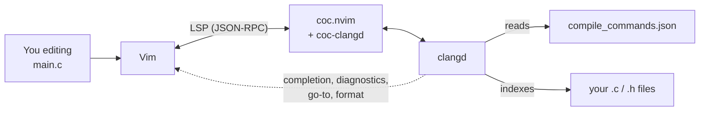
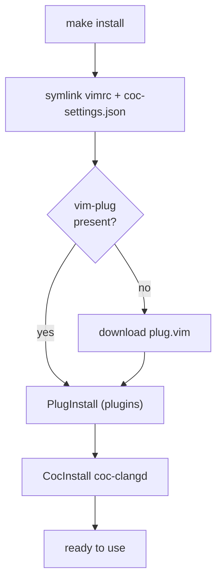
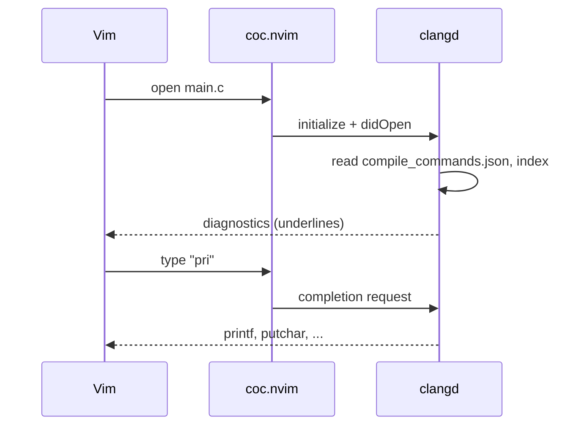
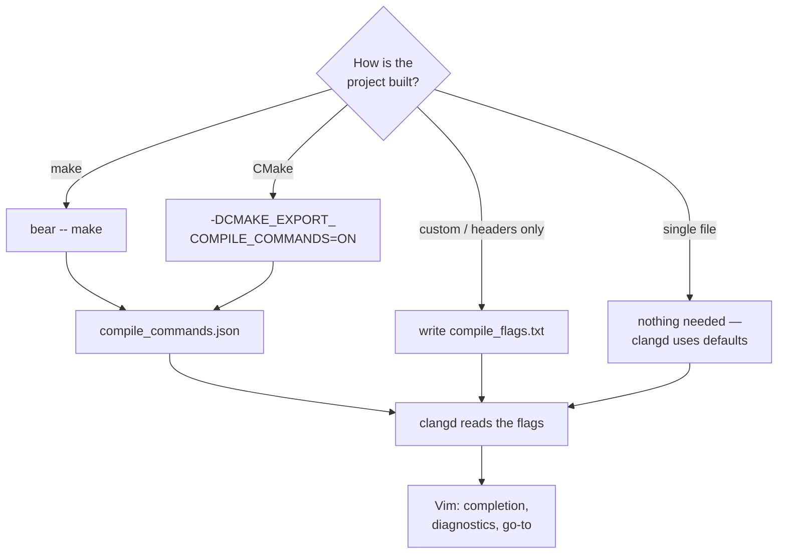

# vim-env

My complete **Vim environment for C development** — config, bootstrap, an example
project, and a visual cheatsheet in one repository.

Language server is **clangd** via **coc.nvim**; theme is **gruvbox**.
A VSCode-like experience (completion, go-to, diagnostics, refactoring) inside
Vim, fully local.

---

## Contents

- [Features](#features)
- [Architecture](#architecture)
- [Requirements](#requirements)
- [Quick start](#quick-start)
- [Makefile targets](#makefile-targets)
- [How it works](#how-it-works)
- [C workflow](#c-workflow)
- [Example project](#example-project)
- [Keybindings](#keybindings)
- [Customizing](#customizing)
- [Full config](#full-config)
- [Troubleshooting](#troubleshooting)
- [Repository layout](#repository-layout)
- [Uninstall](#uninstall)

---

## Features

- **C/C++ LSP** via clangd: completion, `gd`/`gr`, hover, diagnostics, rename,
  code actions, formatting (clang-format).
- **clang-tidy** enabled (static-analysis linter).
- **Background index** of the project (fast navigation across the whole codebase).
- File explorer (NERDTree), fuzzy finder (fzf), status line (airline),
  commenting (nerdcommenter), surround editing (vim-surround).
- A single `./install.sh` (or `make install`) bootstraps everything from scratch.

---

## Architecture

How the pieces talk to each other while you edit:



Vim is the editor, **coc.nvim** is the LSP client, **clangd** is the brain that
actually understands C. clangd learns your build flags from
`compile_commands.json` and indexes your sources, then feeds results back to Vim.

---

## Requirements

| Tool | Why | Check |
|------|-----|-------|
| Vim 8.2+ with `+job +timers +channel` | async LSP | `vim --version \| grep +job` |
| Node.js ≥ 16 | coc.nvim runtime | `node --version` |
| clangd | C/C++ language server | `clangd --version` |
| bear *(optional)* | generates `compile_commands.json` from `make` | `bear --version` |
| git, curl | clone + download vim-plug | — |

Check everything at once with **`make doctor`**.

Installing the system packages:

```bash
# Gentoo
sudo emerge llvm-core/clang dev-util/bear nodejs

# Debian / Ubuntu
sudo apt install clangd bear nodejs

# Arch
sudo pacman -S clang bear nodejs

# macOS (Homebrew)
brew install llvm bear node
```

---

## Quick start

```bash
git clone git@github.com:kewl-ua/vim-c-env.git vim-c-env
cd vim-c-env
make doctor      # check dependencies
make install     # symlinks + vim-plug + plugins + coc-clangd
make example     # build the example and generate compile_commands.json
vim example/main.c
```

> ⚠️ `install` overwrites `~/.vimrc` and `~/.vim/coc-settings.json` with
> **symlinks** into this repository. Back up your own copies if they matter
> (`make uninstall` later removes only those symlinks).

---

## Makefile targets

| Command | What it does |
|---------|--------------|
| `make` / `make help` | list the targets |
| `make doctor` | check vim features, node, clangd, bear |
| `make install` | full bootstrap (`install.sh`) |
| `make link` | only symlink the config files (no plugins) |
| `make update` | `PlugUpdate` + `CocUpdate` |
| `make cheatsheet` | open `cheatsheet/index.html` in a browser |
| `make example` | build the example C project |
| `make clean` | remove the example build artifacts |
| `make uninstall` | remove the symlinks this repo created |

---

## How it works

`install.sh` (or `make install`):

1. **Symlinks** `vimrc → ~/.vimrc` and `coc-settings.json → ~/.vim/coc-settings.json`.
   Edit the files in the repo and changes take effect immediately; `git pull`
   updates the config.
2. **vim-plug** is downloaded to `~/.vim/autoload/plug.vim` if missing.
3. **Plugins** are installed headless (`PlugInstall`). The plugin directory is
   `~/.vimfiles/plugged` (set in `vimrc`).
4. **coc-clangd** is installed as a coc extension; it talks to clangd at the path
   in `coc-settings.json`.

clangd itself is a **system package** — the script does not touch it.

The bootstrap flow:



And what happens the moment you open a C file:



---

## C workflow

```bash
cd <project>
bear -- make      # once, or whenever flags / files change
vim main.c        # clangd picks up compile_commands.json automatically
```

- **Single file** — no `bear` needed, clangd works right away with default flags.
- **Project without `make`** — drop a `compile_flags.txt` in the root, one flag
  per line:
  ```
  -std=c11
  -Wall
  -Iinclude
  ```
- **CMake** — add `-DCMAKE_EXPORT_COMPILE_COMMANDS=ON` and it writes
  `compile_commands.json` itself.

Why it matters: without the flag list, clangd doesn't know your `-I` includes and
`-D` defines, and will complain about `#include`s and macros.

How clangd ends up with the right flags, depending on your project:



---

## Example project

`example/` is a minimal C project to verify the environment right away:

```bash
make example          # bear -- gcc ... → demo + compile_commands.json
./example/demo        # Hello from vim-env — vim-env (2026)
vim example/main.c    # try gd / K / \f / completion
```

It also ships a `.clang-format` — the style `\f` applies (4 spaces, 100 columns).

---

## Keybindings

Full visual version — **`cheatsheet/index.html`** (`make cheatsheet`).
Leader key is `\`.

**Navigation**
| Key | Action |
|-----|--------|
| `gd` / `gr` | go to definition / all references |
| `gy` / `gi` | go to type / implementation |
| `K` | documentation under the cursor |
| `]g` / `[g` | next / previous diagnostic |
| `Ctrl-o` / `Ctrl-i` | jump back / forward |

**Completion**
| Key | Action |
|-----|--------|
| `Tab` / `Shift-Tab` | down / up the list |
| `Enter` | confirm the selection |
| `Ctrl-Space` | trigger manually |

**Refactor / code**
| Key | Action |
|-----|--------|
| `\rn` | rename the symbol everywhere |
| `\ca` | code action (quick-fix) |
| `\f` | format (clang-format) |

**Files / search / edit**
| Key / command | Action |
|---------------|--------|
| `Ctrl-n` | file tree (NERDTree) |
| `:Files` / `:Rg text` | fuzzy-find files / by content |
| `\c<space>` | toggle comment |
| `ysiw"` / `cs"'` / `ds"` | surround / change / delete quotes |

**Inside NERDTree** (after `Ctrl-n`)
| Key | Action |
|-----|--------|
| `o` / `Enter` | open file or expand directory |
| `t` | open in a new tab |
| `i` / `s` | open in a horizontal / vertical split |
| `p` | jump to parent directory |
| `R` | refresh the tree |
| `m` | menu: create / delete / move / copy |
| `I` | toggle hidden files |
| `q` | close the tree |

**Inside fzf** (`:Files`, `:Rg`)
| Key | Action |
|-----|--------|
| `Enter` | open the selection |
| `Ctrl-t` | open in a new tab |
| `Ctrl-x` / `Ctrl-v` | open in a horizontal / vertical split |
| `Tab` / `Shift-Tab` | multi-select (where supported) |
| `Esc` | cancel |

**Surround** (vim-surround), with the cursor on a word
| Keys | Action |
|------|--------|
| `ysiw"` | wrap the word in `"` |
| `cs"'` | change surrounding `"` to `'` |
| `ds"` | delete surrounding `"` |
| `yss)` | wrap the whole line in `()` |

**Commands:** `:CocInfo`, `:CocList diagnostics`, `:CocList extensions`,
`:CocCommand clangd.switchSourceHeader` (`.c` ↔ `.h`), `:PlugInstall`, `:PlugUpdate`.

---

## Customizing

- **Different clangd path** — edit `clangd.path` in `coc-settings.json`
  (find it with `command -v clangd`).
- **Drop clang-tidy or the background index** — remove the matching flag from
  `clangd.arguments` in `coc-settings.json`.
- **Leader on Space** — add `let mapleader=" "` at the top of `vimrc`
  (then `\rn` becomes `<Space>rn`, etc.).
- **Add a plugin** — add a `Plug '...'` line between `plug#begin`/`plug#end` in
  `vimrc`, then `:PlugInstall` (or `make update`).
- **gruvbox in the terminal too** — right now `colorscheme gruvbox` in `vimrc` is
  inside `if has("win32")`; move it out of that block to use it on Linux too.

---

## Full config

The complete config, for reference (the source of truth is the `vimrc` and
`coc-settings.json` files in this repo).

<details>
<summary><strong>vimrc</strong></summary>

```vim
set number
set relativenumber

set ignorecase
set smartcase
set incsearch
set hlsearch

set tabstop=4
set shiftwidth=4
set expandtab

set wildmenu
set wildmode=list:longest

syntax on
set background=dark

set mouse=a

set autoread

set hidden

set scrolloff=3
set wrap
set linebreak
set clipboard=unnamedplus

set cursorline
set showcmd
set showmode
set ruler

set incsearch
set hlsearch

set ttimeoutlen=50

call plug#begin('~/.vimfiles/plugged')
Plug 'tpope/vim-sensible'           " sensible defaults
Plug 'scrooloose/nerdtree'          " file explorer
Plug 'vim-airline/vim-airline'      | " status line
Plug 'vim-airline/vim-airline-themes' " airline themes
Plug 'junegunn/fzf', { 'do': { -> fzf#install() } } | " fuzzy finder
Plug 'junegunn/fzf.vim'
Plug 'morhetz/gruvbox'              " color scheme
Plug 'preservim/nerdcommenter'      " code commenting
Plug 'tpope/vim-surround'
Plug 'neoclide/coc.nvim', {'branch': 'release'}  " LSP client (C/C++ via clangd)
call plug#end()

map <C-n> :NERDTreeToggle<CR>

if has("win32")
    set shell=cmd.exe
    set shellcmdflag=/c
    set t_Co=256
    colorscheme gruvbox
endif

if has("win64")
    set shell=cmd.exe
    set shellcmdflag=/c
    set t_Co=256
endif


" Tab settings for certain file types
autocmd FileType make setlocal noexpandtab softtabstop=0
autocmd FileType typescript,javascript,typescriptreact,javascriptreact setlocal tabstop=2
autocmd FileType typescript,javascript,typescriptreact,javascriptreact setlocal shiftwidth=2
autocmd FileType typescript,javascript,typescriptreact,javascriptreact setlocal softtabstop=2

filetype plugin indent on

" ============================================================
" coc.nvim — language server (clangd for C/C++)
" ============================================================
set updatetime=300          " faster diagnostics
set signcolumn=yes          " keep the sign column so the layout doesn't jump
set nowritebackup           " some LSPs complain about the backup file

" --- Completion ---
" Tab / Shift-Tab navigate the popup, otherwise a normal Tab
inoremap <silent><expr> <TAB>
      \ coc#pum#visible() ? coc#pum#next(1) :
      \ CheckBackspace() ? "\<Tab>" :
      \ coc#refresh()
inoremap <expr><S-TAB> coc#pum#visible() ? coc#pum#prev(1) : "\<C-h>"
" Enter confirms the selected item
inoremap <silent><expr> <CR> coc#pum#visible() ? coc#pum#confirm()
                              \: "\<C-g>u\<CR>\<c-r>=coc#on_enter()\<CR>"
" Ctrl-Space triggers completion manually
inoremap <silent><expr> <c-space> coc#refresh()

function! CheckBackspace() abort
  let col = col('.') - 1
  return !col || getline('.')[col - 1] =~# '\s'
endfunction

" --- Code navigation ---
nmap <silent> gd <Plug>(coc-definition)
nmap <silent> gy <Plug>(coc-type-definition)
nmap <silent> gi <Plug>(coc-implementation)
nmap <silent> gr <Plug>(coc-references)

" --- Jump between diagnostics ---
nmap <silent> [g <Plug>(coc-diagnostic-prev)
nmap <silent> ]g <Plug>(coc-diagnostic-next)

" --- K: show documentation under the cursor ---
nnoremap <silent> K :call ShowDocumentation()<CR>
function! ShowDocumentation()
  if CocAction('hasProvider', 'hover')
    call CocActionAsync('doHover')
  else
    call feedkeys('K', 'in')
  endif
endfunction

" --- Refactor / actions (leader = '\' by default) ---
nmap <leader>rn <Plug>(coc-rename)
nmap <leader>ca <Plug>(coc-codeaction-cursor)
xmap <leader>f  <Plug>(coc-format-selected)
nmap <leader>f  <Plug>(coc-format)

" Highlight all occurrences of the symbol under the cursor
autocmd CursorHold * silent call CocActionAsync('highlight')
```
</details>

<details>
<summary><strong>coc-settings.json</strong></summary>

```json
{
  "clangd.path": "/usr/lib/llvm/22/bin/clangd",
  "clangd.arguments": [
    "--background-index",
    "--clang-tidy",
    "--header-insertion=never",
    "--completion-style=detailed",
    "-j=4"
  ]
}
```
</details>

---

## Troubleshooting

| Symptom | Cause / fix |
|---------|-------------|
| No completion | `:CocInfo` — clangd should be green; `:CocList extensions` — is coc-clangd there |
| `clangd: command not found` in `:CocInfo` | fix `clangd.path` in `coc-settings.json` |
| Complains about `#include "my.h"` | no `compile_commands.json` / `compile_flags.txt` — see [C workflow](#c-workflow) |
| `Tab` inserts a tab instead of completing | make sure the coc block in `vimrc` is present and the coc client is running (`:CocInfo`) |
| Nothing starts | `vim --version \| grep +job` must show `+job`; old Vim without `+job` can't run coc |

---

## Repository layout

```
vim-c-env/
├── vimrc                 # main config (→ ~/.vimrc)
├── coc-settings.json     # coc/clangd settings (→ ~/.vim/coc-settings.json)
├── install.sh            # bootstrap
├── Makefile              # convenience targets (install/update/doctor/...)
├── cheatsheet/
│   └── index.html        # visual cheatsheet (gruvbox)
├── example/
│   ├── main.c            # demo project
│   ├── Makefile          # build (via bear when present)
│   └── .clang-format     # formatting style
└── README.md
```

**Plugins** (vim-plug): coc.nvim, NERDTree, fzf + fzf.vim, vim-airline (+themes),
gruvbox, nerdcommenter, vim-surround, vim-sensible.

---

## Uninstall

```bash
make uninstall     # removes only the ~/.vimrc and ~/.vim/coc-settings.json symlinks
```

Plugins in `~/.vimfiles/plugged`, vim-plug, and coc extensions stay — remove them
by hand if you want a clean slate.
