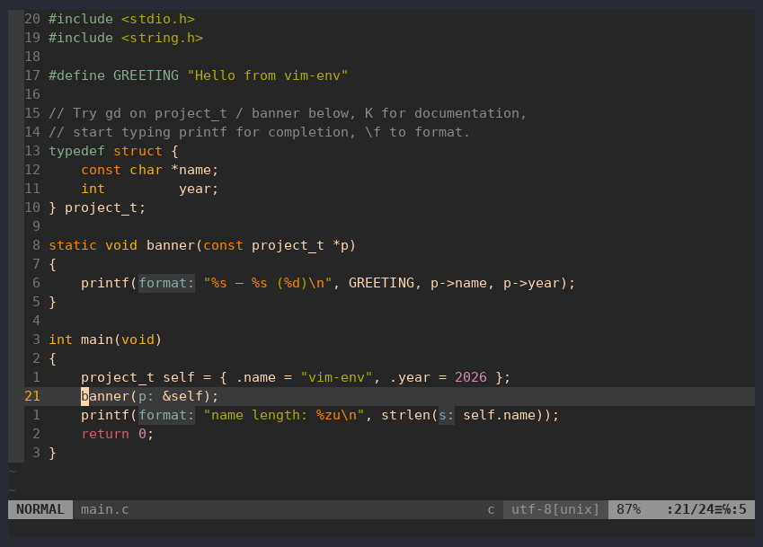

# vim-c-env — Vim як IDE для C/C++ з clangd

[English](README.md) · **Українська**


[](https://github.com/kewl-ua/vim-c-env/actions/workflows/ci.yml)
[](LICENSE)

Готове **середовище Vim для C і C++**: мовний сервер **clangd**, підключений
через **coc.nvim**, плюс сніпети, збірка з помилками в quickfix, дебаг через
**gdb** і git. Встановлюється однією командою на Linux, macOS або Windows,
працює також у Neovim і Docker.



## Можливості

- **Розуміння коду** від clangd: доповнення, перехід до визначення, посилання,
  документація, діагностика наживо, перейменування, code actions, clang-tidy.
- **Форматування** через clang-format, на вимогу або при збереженні.
- **Сніпети** для C: `main`, `for`, `guard`, `st`, `mal` та інші.
- **Збірка** через `make` з Vim; помилки потрапляють у quickfix.
- **Дебаг** через gdb у Termdebug, з клавішами F5/F9/F10/F11.
- **Git:** статус, blame, diff і додавання змін по ханках.
- **Вбудовані системи:** clangd бачить тулчейн `arm-none-eabi`; є приклад для STM32.
- **Шпаргалка всередині Vim:** `:Cheatsheet`.

Кожну фічу показано гіфкою на сторінці [Можливості в дії](docs/uk/features.md).

## Швидкий старт

На Debian або Ubuntu (інші системи: [Встановлення](docs/uk/installation.md)):

```bash
sudo apt install -y vim-nox nodejs npm clangd bear gdb git curl
git clone git@github.com:kewl-ua/vim-c-env.git && cd vim-c-env
make install     # спершу збережіть свій ~/.vimrc: він стане симлінком
vim example/main.c
```

Взагалі без встановлення: `docker build -t vim-c-env . && docker run --rm -it vim-c-env`.

## Головні клавіші

Leader — `\`. Усі клавіші: [Гарячі клавіші](docs/uk/keybindings.md) або `:Cheatsheet` у Vim.

| Клавіша | Дія | Клавіша | Дія |
|---------|-----|---------|-----|
| `gd` / `gr` | визначення / посилання | `\rn` | перейменувати |
| `K` | документація | `\ca` | code action |
| `]g` / `[g` | наступна / попередня діагностика | `\f` | форматувати |
| `Tab` / `Enter` | вибрати / прийняти доповнення | `\h` | `.c` ↔ `.h` |
| `Ctrl-l` | розгорнути сніпет | `\m` | make, помилки в quickfix |
| `\dd ./prog` | запустити дебагер | `F9` / `F10` / `F11` | брейкпоінт / через / всередину |
| `Ctrl-n` | дерево файлів | `\gg` | статус git |

## Документація

| | |
|-|-|
| [Встановлення](docs/uk/installation.md) | дистрибутиви Linux, Windows, macOS; видалення |
| [Можливості в дії](docs/uk/features.md) | гіфка для кожної фічі |
| [Гарячі клавіші](docs/uk/keybindings.md) | усі мапінги за темами |
| [Робочий цикл C](docs/uk/c-workflow.md) | `compile_commands.json`, bear, CMake; приклад |
| [Вбудовані системи](docs/uk/embedded.md) | приклад для STM32, `--query-driver` для clangd |
| [Налаштування](docs/uk/customizing.md) | типові зміни і повний конфіг |
| [Типові проблеми](docs/uk/troubleshooting.md) | симптоми та рішення |
| [Neovim](docs/uk/neovim.md) · [Docker](docs/uk/docker.md) | інші способи запуску |
| [Як це влаштовано](docs/uk/how-it-works.md) · [Розробка](docs/uk/development.md) | внутрішня будова, тести, CI |

## Ліцензія

[GNU GPL v3.0 або новіша](LICENSE). Copyright (C) 2026 kewl-ua.
