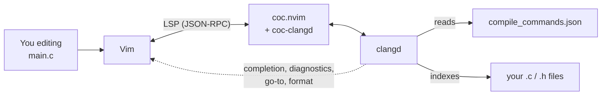
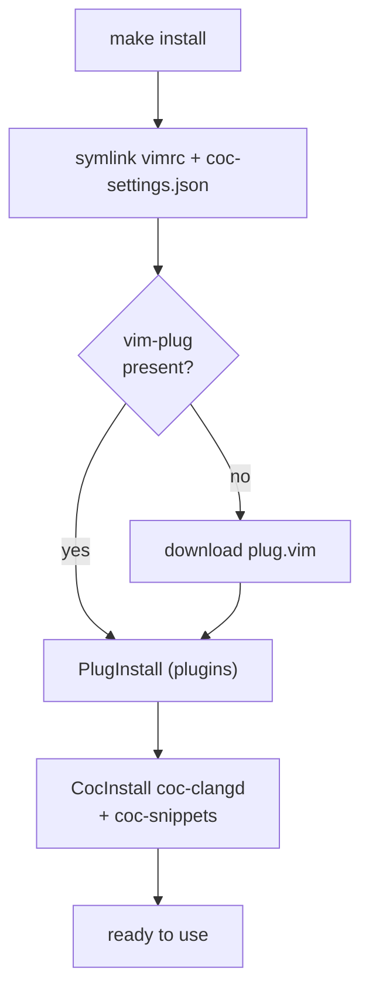
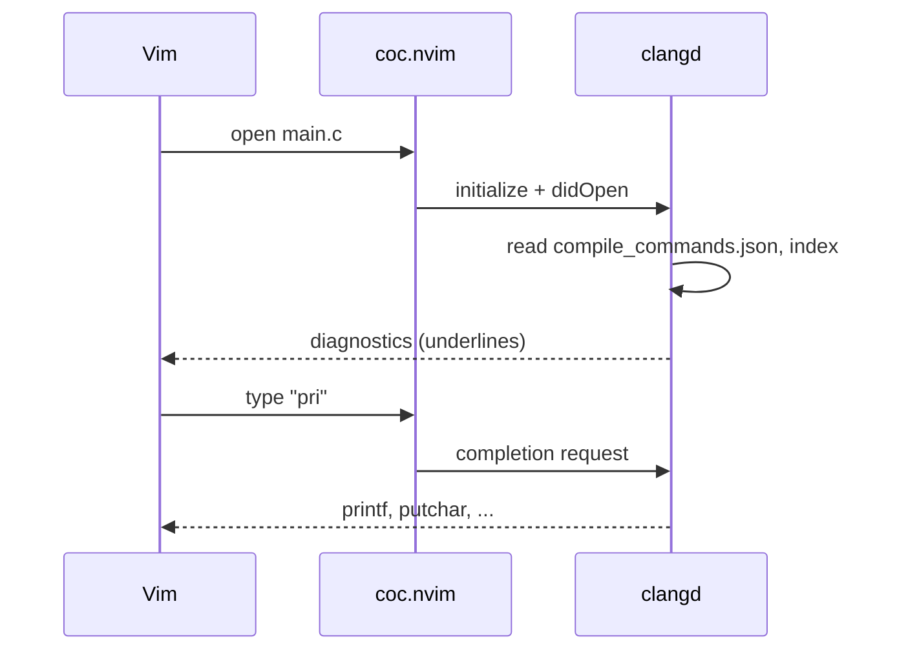
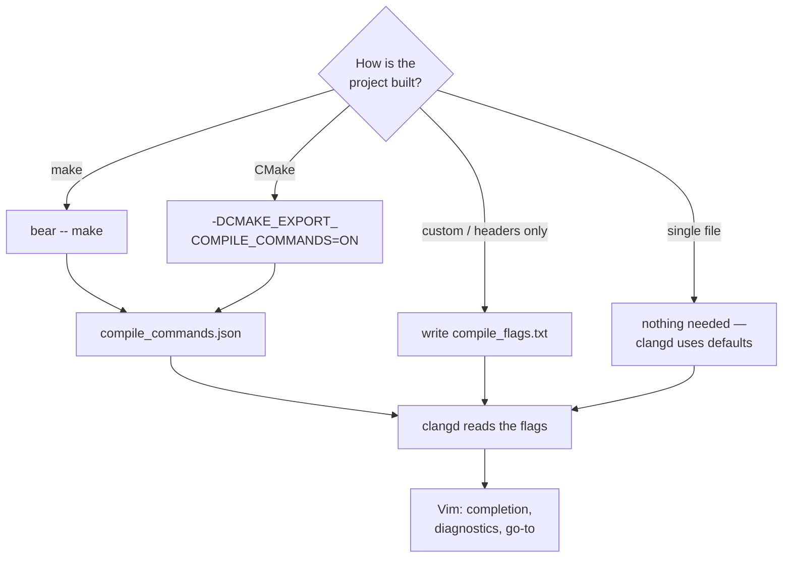

# vim-c-env — Vim як IDE для C/C++ з clangd

[English](README.md) · **Українська**


[](https://github.com/kewl-ua/vim-c-env/actions/workflows/ci.yml)
[](LICENSE)

Готове **середовище Vim для розробки на C та C++**: мовний сервер **clangd**,
підключений до Vim через **coc.nvim**, з автодоповненням, переходом до
визначення, пошуком посилань, документацією під курсором, діагностикою наживо,
перейменуванням і форматуванням через **clang-format**. Це повний `vimrc`,
встановлення однією командою для Linux, macOS і Windows, приклад проєкту та
шпаргалка клавіш.

Робочий процес як у VSCode, але у звичайному Vim, повністю локально, з темою
gruvbox.


*Перехід до визначення, документація, доповнення та clang-format у Vim з clangd.*

---

## Зміст

- [Можливості](#можливості)
- [У дії](#у-дії)
- [Архітектура](#архітектура)
- [Вимоги](#вимоги)
- [Встановлення](#встановлення)
- [Таргети Makefile](#таргети-makefile)
- [Як це влаштовано](#як-це-влаштовано)
- [Робочий цикл C](#робочий-цикл-c)
- [Приклад проєкту](#приклад-проєкту)
- [Вбудовані системи (ARM Cortex-M)](#вбудовані-системи-arm-cortex-m)
- [Гарячі клавіші](#гарячі-клавіші)
- [Налаштування під себе](#налаштування-під-себе)
- [Повний конфіг](#повний-конфіг)
- [Типові проблеми](#типові-проблеми)
- [Структура репозиторію](#структура-репозиторію)
- [Neovim](#neovim)
- [Docker](#docker)
- [Видалення](#видалення)
- [Ліцензія](#ліцензія)

---

## Можливості

- **LSP для C/C++** через clangd: доповнення, `gd`/`gr`, документація,
  діагностика, перейменування, code actions, форматування (clang-format).
- Увімкнено **clang-tidy** (статичний аналіз).
- **Фоновий індекс** проєкту: швидкі переходи по всій кодовій базі.
- **Сніпети** для C (`main`, `for`, `guard`, `st`, `mal`, ...) через coc-snippets.
- **Збірка з Vim:** `\m` запускає `make`, помилки компілятора потрапляють у
  quickfix.
- **Дебаг** через gdb у вбудованому Termdebug: брейкпоінти, кроки, обчислення
  виразів, клавіші F5/F9/F10/F11 як в IDE.
- **Git:** fugitive (status, blame, diff) і gitgutter (позначки змінених
  рядків, ханки).
- **Форматування при збереженні**: вимкнене за замовчуванням, перемикається
  `:FormatOnSaveToggle`.
- Дерево файлів (NERDTree), нечіткий пошук (fzf), статусний рядок (airline),
  коментування (nerdcommenter), робота з дужками й лапками (vim-surround).
- **Шпаргалка всередині Vim:** `:Cheatsheet` відкриває рідну help-сторінку.
- Один `./install.sh` (або `make install`) розгортає все з нуля.

---

## У дії

Усі записи зроблені на [прикладі проєкту](#приклад-проєкту) саме з цим
конфігом.

### Автодоповнення

Після `self.` зʼявляється список полів структури. clangd одразу перевіряє
недописаний рядок: попередження й помилка видно в колонці знаків і в статусному
рядку.


### Перехід до визначення та посилання

`gd` переходить від виклику до визначення, `Ctrl-o` повертає назад, а `gr`
знаходить усі посилання на тип.


### Документація під курсором

`K` показує сигнатуру під курсором, зокрема функцій libc на кшталт `strlen`
разом з їхньою документацією.


### Діагностика

Помилки зʼявляються під час набору. `]g` переходить до наступної, а текст
помилки показується у спливаючому вікні.


### Перейменування

`\rn` перейменовує символ скрізь, де clangd про нього знає. Коментарі не
змінюються.


### Форматування

`\f` проганяє файл через clang-format; тут відступи спершу навмисно зіпсовані.


### Сніпети

Ціла програма з тригерів сніпетів: `inc`, `main`, `for` і `pr`, кожен
розгортається через `Ctrl-l`. `Ctrl-j` переходить до наступного поля.


### Збірка і quickfix

`\m` запускає `make`. Помилка компілятора потрапляє у список quickfix, `Enter`
переходить до неї, а успішна перезбірка закриває список.


### Дебаг

`\dd ./demo` запускає gdb усередині Vim. Брейкпоінт (`\db`), запуск (`\dr`),
крок усередину (`\ds`), крок через (`\dn`), обчислення виразу (`\de`) і
продовження (`\dc`). Записано в Docker-образі, бо Termdebug потребує Vim з
`+terminal`.


### Git

gitgutter позначає змінені (`~`) і додані (`+`) рядки, `]c` ходить по ханках,
`\gp` показує ханк, а `\gg` відкриває статус fugitive.


### Шпаргалка всередині Vim

`:Cheatsheet` (або `\?`) відкриває довідник клавіш як рідну help-сторінку Vim
поруч із кодом. Посилання в змісті працюють через `CTRL-]`, також доступна
команда `:help vim-c-env`.


---

## Архітектура

Як частини взаємодіють, поки ви редагуєте код:



Vim — редактор, **coc.nvim** — LSP-клієнт, **clangd** — «мозок», який справді
розуміє C. clangd бере прапорці збірки з `compile_commands.json`, індексує
вихідні файли й повертає результати у Vim.

---

## Вимоги

| Інструмент | Навіщо | Перевірка |
|------------|--------|-----------|
|  Vim 8.2+ з `+job +timers +channel` | асинхронний LSP | `vim --version \| grep +job` |
|  Node.js ≥ 16 | рушій coc.nvim | `node --version` |
|  clangd | мовний сервер C/C++ | `clangd --version` |
| bear *(необовʼязково)* | створює `compile_commands.json` з `make` | `bear --version` |
| gdb *(необовʼязково)* | дебагер для `:Termdebug`; Vim також потребує `+terminal` | `gdb --version` |
|  git,  curl | клонування і завантаження vim-plug | — |

Усе разом перевіряє **`make doctor`**. Кроки для кожної ОС — у розділі
[Встановлення](#встановлення).

---

## Встановлення

Кроки розраховані на щойно встановлену систему. Поставте залежності для своєї
платформи, потім клонуйте репозиторій і запустіть bootstrap.

###  Linux

Потрібні: Vim з `+job`, Node.js, clangd, bear, git, curl.

####  Debian /  Ubuntu

```bash
sudo apt update
sudo apt install -y vim-nox nodejs npm clangd bear gdb git curl
```

Ставте `vim-nox` (або `vim-gtk3`). У мінімальному `vim-tiny` немає `+job`, а
coc.nvim без нього не працює.

####  Fedora

```bash
sudo dnf install -y vim-enhanced nodejs clang-tools-extra bear gdb git curl
```

clangd входить до пакета `clang-tools-extra`.

####  Arch Linux / Manjaro

```bash
sudo pacman -S --needed vim nodejs clang bear gdb git curl
```

####  openSUSE

```bash
sudo zypper install -y vim nodejs clang-tools bear gdb git curl
```

####  Gentoo

```bash
echo "app-editors/vim terminal" | sudo tee -a /etc/portage/package.use/vim
sudo emerge -q app-editors/vim net-libs/nodejs llvm-core/clang dev-util/bear dev-debug/gdb
```

USE-прапорець `terminal` дає Vim можливість `+terminal`, потрібну дебагеру.

#### Далі, на будь-якому дистрибутиві

```bash
git clone git@github.com:kewl-ua/vim-c-env.git
cd vim-c-env
make doctor      # перевірити, що всі інструменти знайдено
make install     # симлінки + vim-plug + плагіни + coc-clangd
make example     # необовʼязково: зібрати демо-проєкт
vim example/main.c
```

`make doctor` звітує про кожну залежність, а `make example` збирає демо через
bear:


###  Windows

#### Рекомендовано: WSL2

WSL2 запускає справжній Linux, тож кроки для Linux працюють без змін. У
PowerShell від адміністратора:

```powershell
wsl --install -d Ubuntu
```

Перезавантажтеся, відкрийте **Ubuntu** з меню «Пуск» і виконайте всередині
кроки для **Debian / Ubuntu** вище.

#### Нативний Windows (gVim)

```powershell
winget install vim.vim OpenJS.NodeJS LLVM.LLVM Git.Git
```

`install.sh` — bash-скрипт і на нативному Windows не запуститься, тому файли
копіюються вручну. З теки клонованого репозиторію, у PowerShell:

```powershell
copy vimrc "$HOME\_vimrc"
New-Item -ItemType Directory "$HOME\vimfiles\autoload" -Force | Out-Null
copy coc-settings.json "$HOME\vimfiles\coc-settings.json"
iwr -useb https://raw.githubusercontent.com/junegunn/vim-plug/master/plug.vim `
  -OutFile "$HOME\vimfiles\autoload\plug.vim"
New-Item -ItemType Directory "$HOME\vimfiles\pack\vim-c-env\start" -Force | Out-Null
New-Item -ItemType Junction "$HOME\vimfiles\pack\vim-c-env\start\vim-c-env" `
  -Target (Get-Location) | Out-Null
```

Відкрийте gVim і виконайте `:PlugInstall`, `:CocInstall coc-clangd coc-snippets`
та `:helptags ALL` (для `:Cheatsheet`). Конфіг сам перемикає оболонку на
`cmd.exe` у Windows.

###  macOS

```bash
xcode-select --install          # компілятори і make
brew install vim node llvm bear git
```

Homebrew тримає clangd усередині keg `llvm`, поза стандартним `PATH`. Додайте
його:

```bash
echo 'export PATH="$(brew --prefix llvm)/bin:$PATH"' >> ~/.zshrc
source ~/.zshrc
```

Далі клонуйте й запустіть bootstrap, як у розділі
[Далі, на будь-якому дистрибутиві](#далі-на-будь-якому-дистрибутиві).

### Примітки

> **Де шукається clangd.** coc-clangd бере `clangd` з `PATH`. Якщо він
> встановлений деінде, додайте `"clangd.path"` у `coc-settings.json` зі
> значенням з `command -v clangd`.

> ⚠️ **Наявний конфіг.** `make install` замінює `~/.vimrc` і
> `~/.vim/coc-settings.json` **симлінками** на цей репозиторій. Спершу збережіть
> свої файли. `make uninstall` потім прибере лише ці симлінки.

---

## Таргети Makefile

| Команда | Що робить |
|---------|-----------|
| `make` / `make help` | список таргетів |
| `make doctor` | перевіряє можливості Vim, Node, clangd, bear, gdb і Neovim |
| `make install` | повний bootstrap (`install.sh`) |
| `make link` | лише симлінки конфігів і Vim-пакета (без плагінів) |
| `make update` | `PlugUpdate` + `CocUpdate` |
| `make cheatsheet` | відкриває `cheatsheet/index.html` у браузері |
| `make example` | збирає приклад на C |
| `make example-arm` | збирає приклад для Cortex-M4 (потрібен `arm-none-eabi-gcc`) |
| `make test` | smoke-тест встановленого середовища: Vim, Neovim, coc, clangd і приклад |
| `make demos` | перезнімає гіфки README ([деталі](#запис-демо)) |
| `make clean` | прибирає артефакти збірки прикладів |
| `make uninstall` | прибирає створені репозиторієм симлінки |

---

## Як це влаштовано

`install.sh` (або `make install`):

1. **Симлінки** `vimrc → ~/.vimrc` і `coc-settings.json → ~/.vim/coc-settings.json`.
   Зміни у файлах репозиторію діють одразу, а `git pull` оновлює конфіг.
2. **vim-plug** завантажується в `~/.vim/autoload/plug.vim`, якщо його немає.
3. **Плагіни** встановлюються без інтерфейсу (`PlugInstall`) у
   `~/.vimfiles/plugged` (шлях задано у `vimrc`).
4. **coc-clangd** і **coc-snippets** встановлюються як розширення coc;
   coc-clangd запускає `clangd` з `PATH` з прапорцями з `coc-settings.json`.
5. **Сам репозиторій** підключається як Vim-пакет
   (`~/.vim/pack/vim-c-env/start/vim-c-env`), тож Vim автоматично завантажує
   `plugin/` (команду `:Cheatsheet`) і `doc/` (help-сторінку).
6. **Neovim**, якщо він встановлений і ще не налаштований, отримує симлінк
   `~/.config/nvim/init.vim` на `nvim/init.vim`.

Сам clangd — **системний пакет**, скрипт його не чіпає.

Порядок bootstrap:



І що відбувається в момент відкриття файлу на C:



---

## Робочий цикл C

```bash
cd <проєкт>
bear -- make      # один раз або коли змінились прапорці чи файли
vim main.c        # clangd сам підхопить compile_commands.json
```

- **Один файл** — `bear` не потрібен, clangd одразу працює зі стандартними
  прапорцями.
- **Проєкт без `make`** — покладіть у корінь `compile_flags.txt`, по одному
  прапорцю в рядку:
  ```
  -std=c11
  -Wall
  -Iinclude
  ```
- **CMake** — додайте `-DCMAKE_EXPORT_COMPILE_COMMANDS=ON`, і він сам створить
  `compile_commands.json`.

Навіщо це: без списку прапорців clangd не знає ваших `-I` та `-D` і лається на
`#include` і макроси.

Як clangd отримує правильні прапорці залежно від проєкту:



---

## Приклад проєкту

`example/` — мінімальний проєкт на C, щоб одразу перевірити середовище:

```bash
make example          # bear -- gcc ... → demo + compile_commands.json
./example/demo        # Hello from vim-env — vim-env (2026)
vim example/main.c    # спробуйте gd / K / \f / доповнення
```

Там же лежить `.clang-format` — стиль, який застосовує `\f` (4 пробіли, 100
колонок).

---

## Вбудовані системи (ARM Cortex-M)

Той самий конфіг працює і для прошивок мікроконтролерів. `example-arm/` —
мінімальний bare-metal проєкт для STM32F407 (STM32F4-Discovery), що блимає
зеленим світлодіодом на PD12: `main.c` на рівні регістрів, `startup.c` з
таблицею векторів і лінкер-скрипт.

```bash
sudo apt install gcc-arm-none-eabi libnewlib-arm-none-eabi stlink-tools
cd example-arm
bear -- make          # blink.elf, blink.bin і compile_commands.json
make flash            # записати blink.bin через st-flash
vim main.c
```

**Навіщо `--query-driver`.** `coc-settings.json` запускає clangd з
`--query-driver=**/arm-none-eabi-*`. Так clangd може спитати в крос-компілятора
його власні шляхи до заголовків. Без цього clangd не знаходить заголовки newlib
з тулчейна (`<string.h>`, `<stdlib.h>` і все, що тягнуть HAL і CMSIS) і
підсвічує код червоним. Перевірено через `clangd --check` на файлі, що їх
підключає:

| Прапорці clangd | Результат |
|-----------------|-----------|
| за замовчуванням | 3 помилки (`'string.h' file not found`, ...) |
| `--query-driver=**/arm-none-eabi-*` | 0 помилок |

Шаблон дозволяє clangd запускати лише компілятори, чия назва починається з
`arm-none-eabi-`. Для іншого тулчейна додайте його шаблон у той самий прапорець
через кому, наприклад `**/riscv64-unknown-elf-*`.

---

## Гарячі клавіші

У Vim: **`:Cheatsheet`** або **`\?`** відкриває цей довідник як help-сторінку
(`:help vim-c-env`). У браузері: **`cheatsheet/index.html`** (`make cheatsheet`).
Leader-клавіша — `\`.

**Навігація**
| Клавіша | Дія |
|---------|-----|
| `gd` / `gr` | до визначення / усі посилання |
| `gy` / `gi` | до типу / реалізації |
| `K` | документація під курсором |
| `]g` / `[g` | наступна / попередня діагностика |
| `Ctrl-o` / `Ctrl-i` | назад / вперед по переходах |

**Автодоповнення**
| Клавіша | Дія |
|---------|-----|
| `Tab` / `Shift-Tab` | вниз / вгору по списку |
| `Enter` | підтвердити вибір |
| `Ctrl-Space` | викликати вручну |

**Рефакторинг і код**
| Клавіша | Дія |
|---------|-----|
| `\rn` | перейменувати символ скрізь |
| `\ca` | code action (quick-fix) |
| `\h` | перемкнутися між `foo.c` і `foo.h` |
| `\f` | форматувати (clang-format) |
| `:FormatOnSaveToggle` | форматувати C/C++ при кожному `:w` |

**Сніпети** (наберіть тригер і натисніть `Ctrl-l` або виберіть його в меню доповнення)
| Клавіша / тригер | Дія |
|------------------|-----|
| `main` `for` `if` `sw` `st` `guard` `pr` `mal` | тригери сніпетів C ([повний список](UltiSnips/c.snippets)) |
| `Ctrl-l` | розгорнути тригер перед курсором |
| `Ctrl-j` / `Ctrl-k` | наступне / попереднє поле |

**Збірка і quickfix**
| Клавіша | Дія |
|---------|-----|
| `\m` | запустити `:make`; помилки відкриваються в quickfix |
| `]q` / `[q` | наступна / попередня помилка |
| `Enter` (у quickfix) | перейти до помилки |

**Дебаг** (gdb через Termdebug; збирайте з `-g`)
| Клавіша | Дія |
|---------|-----|
| `\dd` | старт: вкажіть програму, напр. `\dd ./demo` |
| `\db` / `F9` | брейкпоінт на рядку курсора |
| `\dx` | прибрати брейкпоінт |
| `\dr` | запустити |
| `\dc` / `F5` | продовжити |
| `\dn` / `F10` | крок через |
| `\ds` / `F11` | крок усередину |
| `\df` | завершити поточну функцію |
| `\de` / `K` | обчислити вираз під курсором |

**Git**
| Клавіша | Дія |
|---------|-----|
| `\gg` | статус (fugitive): `s` додає в індекс, `cc` комітить |
| `\gb` | blame |
| `\gd` | diff з індексом |
| `]c` / `[c` | наступний / попередній ханк |
| `\gp` / `\gs` / `\gu` | показати / додати в індекс / скасувати ханк |

**Файли, пошук, правки**
| Клавіша / команда | Дія |
|-------------------|-----|
| `Ctrl-n` | дерево файлів (NERDTree) |
| `:Files` / `:Rg текст` | нечіткий пошук файлів / по вмісту |
| `\c<space>` | закоментувати / розкоментувати |
| `ysiw"` / `cs"'` / `ds"` | обгорнути / змінити / прибрати лапки |

**У NERDTree** (після `Ctrl-n`)
| Клавіша | Дія |
|---------|-----|
| `o` / `Enter` | відкрити файл або розгорнути теку |
| `t` | відкрити в новій вкладці |
| `i` / `s` | відкрити в горизонтальному / вертикальному спліті |
| `p` | до батьківської теки |
| `R` | оновити дерево |
| `m` | меню: створити / видалити / перемістити / копіювати |
| `I` | показати / сховати приховані файли |
| `q` | закрити дерево |


**У fzf** (`:Files`, `:Rg`)
| Клавіша | Дія |
|---------|-----|
| `Enter` | відкрити вибране |
| `Ctrl-t` | відкрити в новій вкладці |
| `Ctrl-x` / `Ctrl-v` | відкрити в горизонтальному / вертикальному спліті |
| `Tab` / `Shift-Tab` | множинний вибір (де підтримується) |
| `Esc` | скасувати |

**Surround** (vim-surround), курсор на слові
| Клавіші | Дія |
|---------|-----|
| `ysiw"` | обгорнути слово в `"` |
| `cs"'` | змінити `"` навколо на `'` |
| `ds"` | прибрати `"` навколо |
| `yss)` | обгорнути весь рядок у `()` |

**Команди:** `:Cheatsheet`, `:FormatOnSaveToggle`, `:Termdebug ./prog`, `:CocInfo`,
`:CocList diagnostics`, `:CocList extensions`, `:CocCommand clangd.switchSourceHeader`
(`.c` ↔ `.h`), `:PlugInstall`, `:PlugUpdate`.

---

## Налаштування під себе

- **Конкретний clangd** — за замовчуванням береться той, що в `PATH`. Щоб
  закріпити інший, додайте `"clangd.path": "/path/to/clangd"` у
  `coc-settings.json`.
- **Без clang-tidy чи фонового індексу** — приберіть відповідний прапорець зі
  списку `clangd.arguments` у `coc-settings.json`.
- **Leader на пробілі** — додайте `let mapleader=" "` на початок `vimrc`
  (тоді `\rn` стане `<Space>rn` і т. д.).
- **Новий плагін** — додайте рядок `Plug '...'` між `plug#begin` і `plug#end` у
  `vimrc`, потім `:PlugInstall` (або `make update`).
- **Форматування при збереженні за замовчуванням** — додайте
  `let g:c_format_on_save = 1` перед блоком coc у `vimrc`.
- **Інша кольорова схема** — замініть `silent! colorscheme gruvbox` у `vimrc`.

---

## Повний конфіг

Повний конфіг лежить у файлах [`vimrc`](vimrc), [`coc-settings.json`](coc-settings.json)
і [`nvim/init.vim`](nvim/init.vim). Англійський README містить його повну копію в
розділі [Full config](README.md#full-config).

---

## Типові проблеми

| Симптом | Причина / рішення |
|---------|-------------------|
| Немає доповнення | `:CocInfo` — clangd має бути запущений; `:CocList extensions` — чи є coc-clangd |
| `clangd: command not found` у `:CocInfo` | встановіть clangd (див. [Встановлення](#встановлення)) або додайте `"clangd.path"` у `coc-settings.json` |
| Помилки на `#include "my.h"` | немає `compile_commands.json` / `compile_flags.txt` — див. [Робочий цикл C](#робочий-цикл-c) |
| `Tab` вставляє табуляцію замість доповнення | перевірте, що блок coc є у `vimrc` і клієнт coc запущений (`:CocInfo`) |
| `\dd` пише, що Vim потребує `+terminal` | Termdebug у Vim 9.1 без нього не працює. Поставте повну збірку (`vim-nox`, `vim-gtk3`; Gentoo: `USE=terminal`) або користуйтеся Neovim |
| Нічого не запускається | `vim --version \| grep +job` має показати `+job`; старий Vim без `+job` не потягне coc |

---

## Структура репозиторію

```
vim-c-env/
├── vimrc                 # main config (→ ~/.vimrc)
├── nvim/init.vim         # Neovim entry point (→ ~/.config/nvim/init.vim)
├── coc-settings.json     # coc/clangd settings (→ ~/.vim/coc-settings.json)
├── install.sh            # bootstrap
├── Makefile              # convenience targets (install/update/doctor/...)
├── Dockerfile            # the whole environment in a container
├── .github/workflows/    # CI (lint + install test) and Docker publishing
├── scripts/
│   ├── smoke-test.sh     # make test: headless checks of the setup
│   ├── smoke.vim         # the Vim-side half of those checks
│   └── record-demos.sh   # re-records the README gifs (make demos)
├── _config.yml           # GitHub Pages / SEO settings
├── assets/               # demo gifs + social preview image
├── UltiSnips/
│   └── c.snippets        # C snippets for coc-snippets
├── doc/
│   └── vim-c-env.txt     # cheatsheet as a Vim help page (:Cheatsheet)
├── plugin/
│   └── vim-c-env.vim     # defines :Cheatsheet and \?
├── cheatsheet/
│   └── index.html        # visual cheatsheet (gruvbox)
├── example-arm/          # bare-metal STM32F407 blink (Cortex-M4)
├── example/
│   ├── main.c            # demo project
│   ├── Makefile          # build (via bear when present)
│   └── .clang-format     # formatting style
├── README.md
├── README.uk.md          # this README in Ukrainian
└── LICENSE               # GNU GPL v3
```

**Плагіни** (vim-plug): coc.nvim, NERDTree, fzf + fzf.vim, vim-airline (+themes),
gruvbox, nerdcommenter, vim-surround, vim-sensible, vim-fugitive, vim-gitgutter.
Вбудований: Termdebug. Розширення coc: coc-clangd, coc-snippets.

---

## Neovim

Той самий конфіг працює в Neovim 0.8+ через [`nvim/init.vim`](nvim/init.vim).
Він завантажує `vimrc` з цього репозиторію, додає репозиторій у `runtimepath`
(для `:Cheatsheet`, help-сторінки й сніпетів) і вказує coc на той самий
`coc-settings.json`.

`make install` створює симлінк `~/.config/nvim/init.vim` лише тоді, коли у вас
ще немає конфігу Neovim. Якщо він є, `make install` його не чіпає; додайте в
нього рядок:

```vim
source ~/path/to/vim-c-env/nvim/init.vim
```

У Neovim термінал вбудований завжди, тож дебагер працює там навіть тоді, коли
Vim зібраний без `+terminal`. `make test` повторює перевірки Vim у Neovim.

---

## Docker

Спробуйте все середовище, нічого не встановлюючи. В образі є Vim з `+terminal`
(тож дебагер працює), clangd, gdb, bear і ARM-тулчейн.

```bash
docker build -t vim-c-env .
docker run --rm -it vim-c-env                         # відкриває example/main.c
docker run --rm -it -v "$PWD":/work -w /work vim-c-env vim yourfile.c
```

Кожен тег релізу (`v*`) також публікує образ у GitHub Container Registry,
після того як усередині нього проходить `make test`:

```bash
docker run --rm -it ghcr.io/kewl-ua/vim-c-env
```

### Безперервна інтеграція

[`ci.yml`](.github/workflows/ci.yml) запускається на кожен push: shellcheck і
vint, перевірка help-сторінки, потім чисті `make install` і `make test` на
Ubuntu та macOS.

### Запис демо

Кожна гіфка в README зроблена скриптом `scripts/record-demos.sh` (`make demos`).
Він керує Vim через tmux з конфігом цього репозиторію, записує через asciinema
і рендерить через agg. Скрипт працює на тимчасовій копії `example/`, тож
репозиторій лишається недоторканим. `scripts/record-demos.sh hover git`
перезнімає лише ці дві. Демо дебагера записується в Docker-образі, якщо
локальний Vim не має `+terminal`.

---

## Видалення

```bash
make uninstall     # прибирає лише наші симлінки: ~/.vimrc, coc-settings.json, Vim-пакет, nvim init.vim
```

Плагіни в `~/.vimfiles/plugged`, vim-plug і розширення coc лишаються —
приберіть їх вручну, якщо хочете повністю очистити систему.

---

## Ліцензія

Copyright (C) 2026 kewl-ua

Цей проєкт — вільне програмне забезпечення: ви можете поширювати та змінювати
його на умовах **GNU General Public License v3.0** або (на ваш вибір) будь-якої
пізнішої версії. Повний текст — у файлі [LICENSE](LICENSE).
