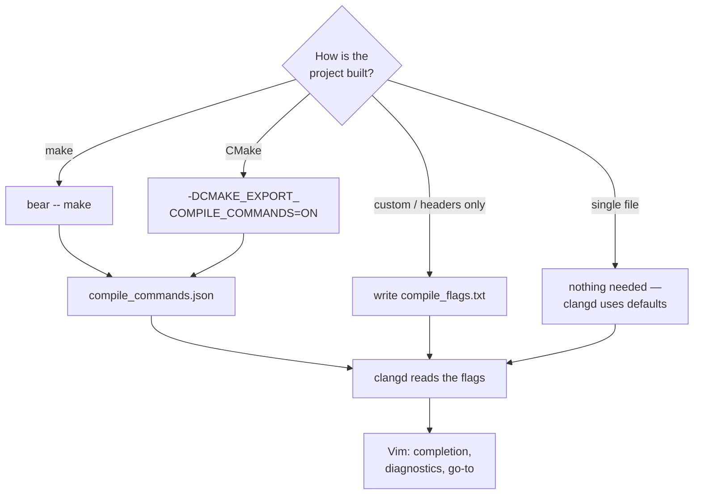

# C workflow

[← vim-c-env](../README.md) · [All docs](README.md) · **English** · [Українська](uk/c-workflow.md)

## C workflow

```bash
cd <project>
bear -- make      # once, or whenever flags / files change
vim main.c        # clangd picks up compile_commands.json automatically
```

- **Single file** — no `bear` needed, clangd works right away with default flags.
- **Project without `make`** — drop a `compile_flags.txt` in the root, one flag
  per line:
  ```
  -std=c11
  -Wall
  -Iinclude
  ```
- **CMake** — add `-DCMAKE_EXPORT_COMPILE_COMMANDS=ON` and it writes
  `compile_commands.json` itself.

Why it matters: without the flag list, clangd doesn't know your `-I` includes and
`-D` defines, and will complain about `#include`s and macros.

How clangd ends up with the right flags, depending on your project:



---

## Example project

`example/` is a minimal C project to verify the environment right away:

```bash
make example          # bear -- gcc ... → demo + compile_commands.json
./example/demo        # Hello from vim-env — vim-env (2026)
vim example/main.c    # try gd / K / \f / completion
```

It also ships a `.clang-format` — the style `\f` applies (4 spaces, 100 columns).
