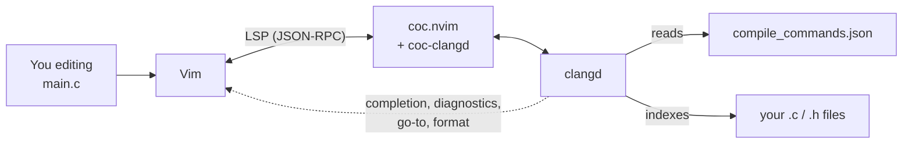
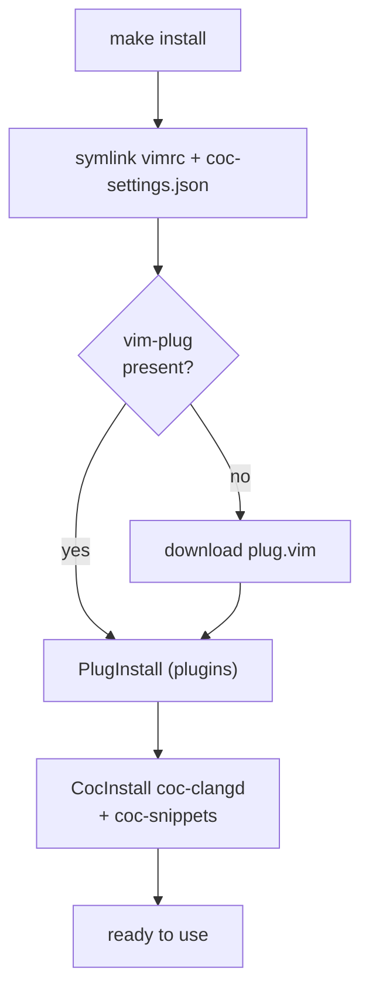
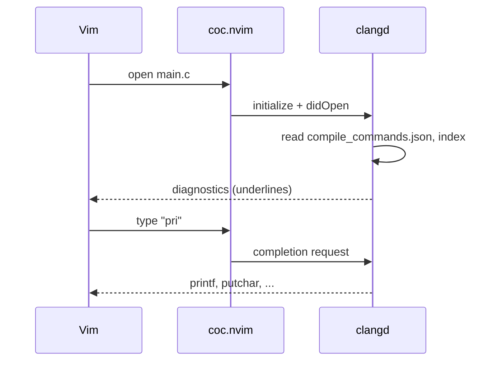

# How it works

[← vim-c-env](../README.md) · [All docs](README.md) · **English** · [Українська](uk/how-it-works.md)

## Architecture

How the pieces talk to each other while you edit:

Vim is the editor, **coc.nvim** is the LSP client, **clangd** is the brain that
actually understands C. clangd learns your build flags from
`compile_commands.json` and indexes your sources, then feeds results back to Vim.

---

## What make install does

`install.sh` (or `make install`):

1. **Symlinks** `vimrc → ~/.vimrc` and `coc-settings.json → ~/.vim/coc-settings.json`.
   Edit the files in the repo and changes take effect immediately; `git pull`
   updates the config.
2. **vim-plug** is downloaded to `~/.vim/autoload/plug.vim` if missing.
3. **Plugins** are installed headless (`PlugInstall`). The plugin directory is
   `~/.vimfiles/plugged` (set in `vimrc`).
4. **coc-clangd** and **coc-snippets** are installed as coc extensions;
   coc-clangd starts the `clangd` it finds on your `PATH`, with the flags from
   `coc-settings.json`.
5. **The repo itself** is linked as a Vim package
   (`~/.vim/pack/vim-c-env/start/vim-c-env`), so Vim loads `plugin/` (the
   `:Cheatsheet` command) and `doc/` (the help page) automatically.
6. **Neovim**, if installed and not configured yet, gets
   `~/.config/nvim/init.vim` linked to `nvim/init.vim`.

clangd itself is a **system package** — the script does not touch it.

The bootstrap flow:

And what happens the moment you open a C file:

