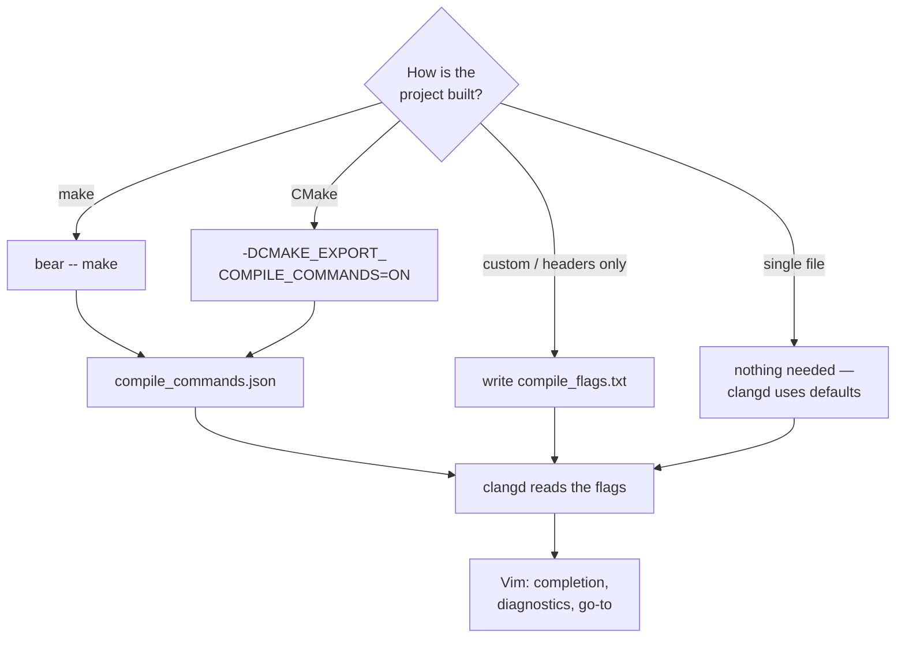

# Робочий цикл C

[← vim-c-env](../../README.uk.md) · [Уся документація](README.md) · [English](../c-workflow.md) · **Українська**

## Робочий цикл C

```bash
cd <проєкт>
bear -- make      # один раз або коли змінились прапорці чи файли
vim main.c        # clangd сам підхопить compile_commands.json
```

- **Один файл** — `bear` не потрібен, clangd одразу працює зі стандартними
  прапорцями.
- **Проєкт без `make`** — покладіть у корінь `compile_flags.txt`, по одному
  прапорцю в рядку:
  ```
  -std=c11
  -Wall
  -Iinclude
  ```
- **CMake** — додайте `-DCMAKE_EXPORT_COMPILE_COMMANDS=ON`, і він сам створить
  `compile_commands.json`.

Навіщо це: без списку прапорців clangd не знає ваших `-I` та `-D` і лається на
`#include` і макроси.

Як clangd отримує правильні прапорці залежно від проєкту:



---

## Приклад проєкту

`example/` — мінімальний проєкт на C, щоб одразу перевірити середовище:

```bash
make example          # bear -- gcc ... → demo + compile_commands.json
./example/demo        # Hello from vim-env — vim-env (2026)
vim example/main.c    # спробуйте gd / K / \f / доповнення
```

Там же лежить `.clang-format` — стиль, який застосовує `\f` (4 пробіли, 100
колонок).
