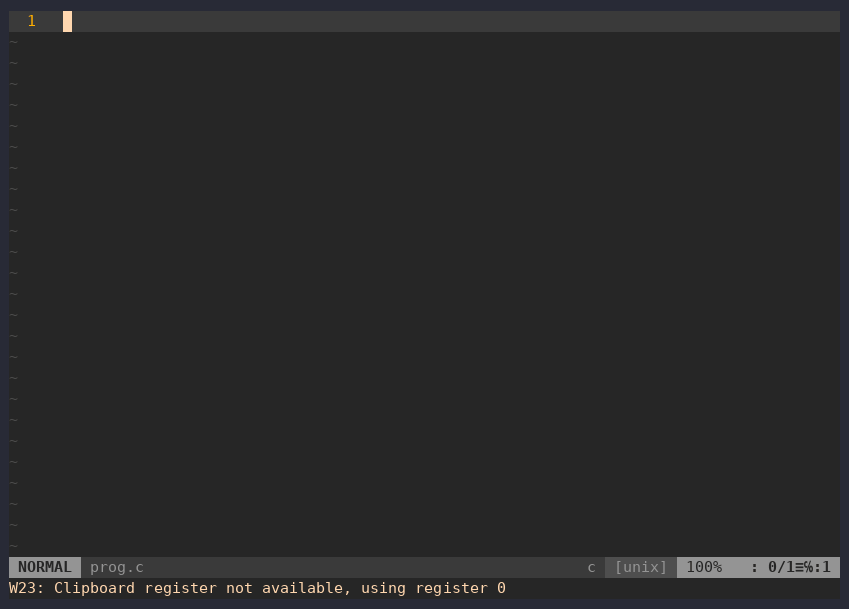
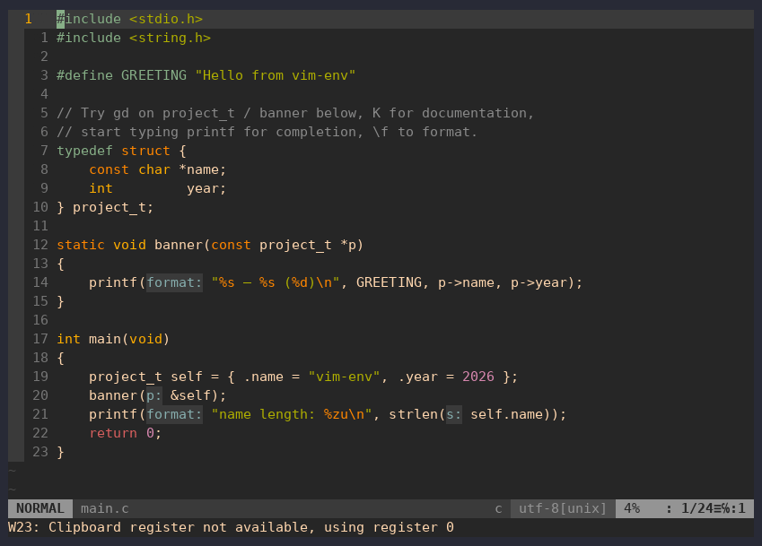
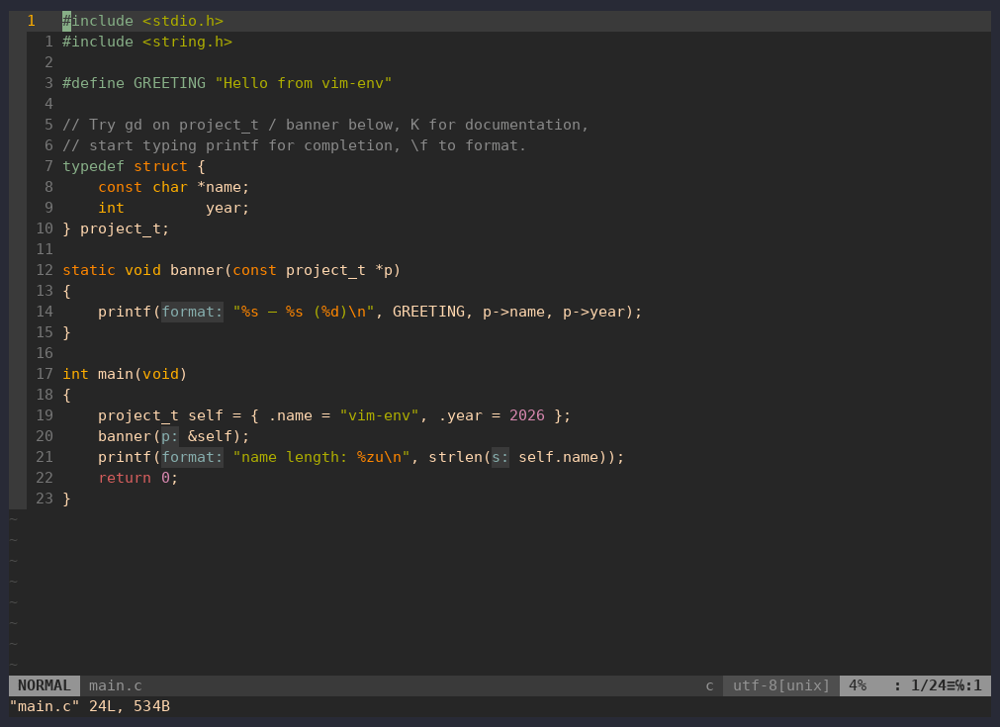
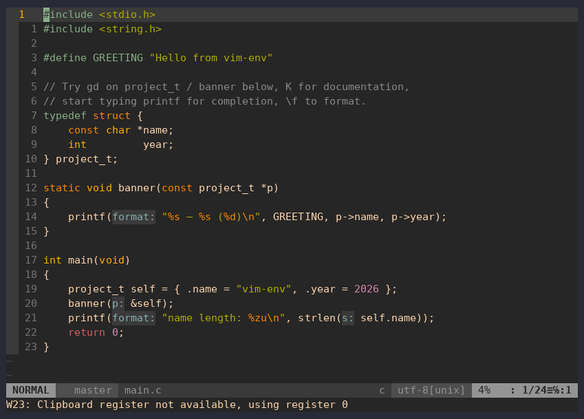

# Можливості в дії

[← vim-c-env](../../README.uk.md) · [Уся документація](README.md) · [English](../features.md) · **Українська**

Усі записи зроблені на [прикладі проєкту](c-workflow.md#приклад-проєкту) саме з цим
конфігом.

## Автодоповнення

Після `self.` зʼявляється список полів структури. clangd одразу перевіряє
недописаний рядок: попередження й помилка видно в колонці знаків і в статусному
рядку.

## Перехід до визначення та посилання

`gd` переходить від виклику до визначення, `Ctrl-o` повертає назад, а `gr`
знаходить усі посилання на тип.

## Документація під курсором

`K` показує сигнатуру під курсором, зокрема функцій libc на кшталт `strlen`
разом з їхньою документацією.

## Діагностика

Помилки зʼявляються під час набору. `]g` переходить до наступної, а текст
помилки показується у спливаючому вікні.

## Перейменування

`\rn` перейменовує символ скрізь, де clangd про нього знає. Коментарі не
змінюються.

## Форматування

`\f` проганяє файл через clang-format; тут відступи спершу навмисно зіпсовані.

## Сніпети

Ціла програма з тригерів сніпетів: `inc`, `main`, `for` і `pr`, кожен
розгортається через `Ctrl-l`. `Ctrl-j` переходить до наступного поля.

## Збірка і quickfix

`\m` запускає `make`. Помилка компілятора потрапляє у список quickfix, `Enter`
переходить до неї, а успішна перезбірка закриває список.

## Дебаг

`\dd ./demo` запускає gdb усередині Vim. Брейкпоінт (`\db`), запуск (`\dr`),
крок усередину (`\ds`), крок через (`\dn`), обчислення виразу (`\de`) і
продовження (`\dc`). Записано в Docker-образі, бо Termdebug потребує Vim з
`+terminal`.

## Git

gitgutter позначає змінені (`~`) і додані (`+`) рядки, `]c` ходить по ханках,
`\gp` показує ханк, а `\gg` відкриває статус fugitive.

## Шпаргалка всередині Vim

`:Cheatsheet` (або `\?`) відкриває довідник клавіш як рідну help-сторінку Vim
поруч із кодом. Посилання в змісті працюють через `CTRL-]`, також доступна
команда `:help vim-c-env`.

