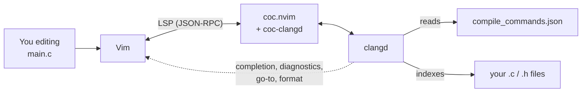
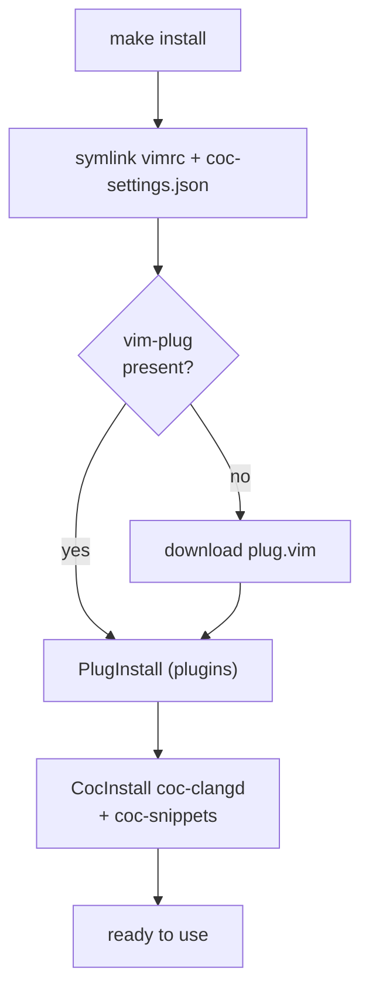
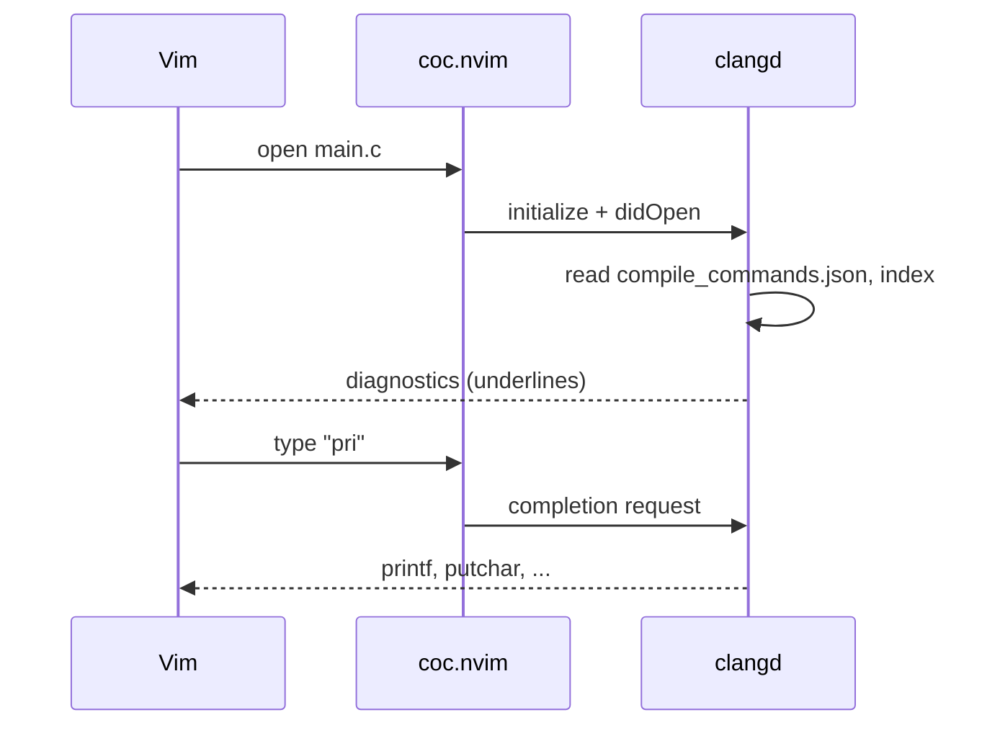

# Як це влаштовано

[← vim-c-env](../../README.uk.md) · [Уся документація](README.md) · [English](../how-it-works.md) · **Українська**

## Архітектура

Як частини взаємодіють, поки ви редагуєте код:

Vim — редактор, **coc.nvim** — LSP-клієнт, **clangd** — «мозок», який справді
розуміє C. clangd бере прапорці збірки з `compile_commands.json`, індексує
вихідні файли й повертає результати у Vim.

---

## Що робить make install

`install.sh` (або `make install`):

1. **Симлінки** `vimrc → ~/.vimrc` і `coc-settings.json → ~/.vim/coc-settings.json`.
   Зміни у файлах репозиторію діють одразу, а `git pull` оновлює конфіг.
2. **vim-plug** завантажується в `~/.vim/autoload/plug.vim`, якщо його немає.
3. **Плагіни** встановлюються без інтерфейсу (`PlugInstall`) у
   `~/.vimfiles/plugged` (шлях задано у `vimrc`).
4. **coc-clangd** і **coc-snippets** встановлюються як розширення coc;
   coc-clangd запускає `clangd` з `PATH` з прапорцями з `coc-settings.json`.
5. **Сам репозиторій** підключається як Vim-пакет
   (`~/.vim/pack/vim-c-env/start/vim-c-env`), тож Vim автоматично завантажує
   `plugin/` (команду `:Cheatsheet`) і `doc/` (help-сторінку).
6. **Neovim**, якщо він встановлений і ще не налаштований, отримує симлінк
   `~/.config/nvim/init.vim` на `nvim/init.vim`.

Сам clangd — **системний пакет**, скрипт його не чіпає.

Порядок bootstrap:

І що відбувається в момент відкриття файлу на C:

